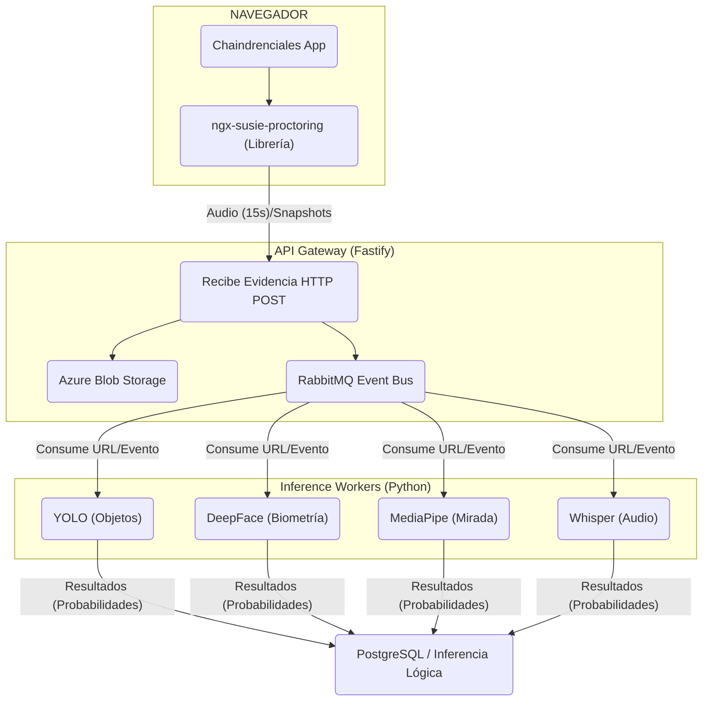

# 🏗️ Arquitectura de Software SUSIE (Consolidada)

> **Fecha:** 21 de Febrero de 2026
> **Propósito:** Documento unificado de arquitectura técnica y de integración de SUSIE.

---

## 1. Visión General: Un Motor de Exámenes Completo

SUSIE **no es solo un overlay de proctoring**. SUSIE **es el motor completo de exámenes** que reemplaza el visor de exámenes de Chaindrenciales cuando se requiere supervisión.

### Principio "Contract First"
La comunicación entre servicios se rige por contratos JSON estrictos. Esto permite que el Frontend envíe evidencias asíncronamente mientras el Backend y la IA las procesan sin bloquear el examen de cadena. La latencia se minimiza.

---

## 2. Estrategia de Integración Frontend

SUSIE se distribuye como una librería de npm (`ngx-susie-proctoring`). Chaindrenciales empaqueta esta librería dentro de su propia aplicación Angular. **La librería corre directamente en el navegador del candidato.**

```typescript
// En la app de Chaindrenciales:
import { SusieWrapperComponent } from 'ngx-susie-proctoring';

// En el template:
<susie-wrapper [config]="examConfig" (examFinished)="onExamFinished($event)" />
```

---

## 3. Arquitectura del Sistema: Event-Driven Microservices

SUSIE opera bajo una arquitectura distribuida orientada a eventos para desacoplar componentes.



### Capas del Sistema
1. **Frontend (Librería):** Captura video/audio. Muestra timer y preguntas. Implementa bloqueos (full-screen, focus tracking). Envía chunks de evidencia (Audio WebM cada 15s, **Snapshots periódicos** y **Eventos de Navegación** como cambio de pestaña).
2. **API Gateway (Fastify):** Punto único. Sube imágenes o audio "crudos" a Azure Blob Storage y encola mensajes a RabbitMQ en un enfoque asíncrono "Fire and Forget" para las evidencias. **También gestiona llamadas síncronas para el enrolamiento y verificación biométrica frontal.**
3. **Event Bus (RabbitMQ):** Desacopla la API rápida del procesamiento intensivo. El API publica en el exchange `susie.events`, y las colas como `susie.ai.vision` o `susie.ai.audio` distribuyen la carga.
4. **AI Services:** Workers de Python que consumen de RabbitMQ, analizan las URLs descargables de Azure y devuelven un riesgo individual por cada evidencia evaluada. **El worker biométrico (DeepFace) también expone endpoints HTTP/gRPC para respuestas síncronas inmediatas.**
5. **Persistencia e Inferencia Lógica:** PostgreSQL y Redis para persistir sesiones, configuraciones, **embeddings biométricos** y **consolidar riesgos probabilísticos**. El riesgo final del examen no se evalúa por un solo evento, sino por la correlación matemática de todas las variables (Audio, Snapshots y Eventos de Navegador).

---

## 4. Arquitectura de Biométricos (DeepFace)

El análisis biométrico tiene características especiales que lo separan de la asincronía estándar:
* **Es estrictamente Síncrono:** El usuario no puede iniciar el examen sin validar su identidad (verificación biométrica en vivo). Por tanto, la llamada al API `/biometrics/enroll` o `/biometrics/verify` no va por RabbitMQ, sino que el API Gateway interactúa directamente con el worker de IA para obtener una respuesta in-mediata. 
* **Uso de Embeddings:** SUSIE **no persiste caras en bruto para comparar**. DeepFace convierte la foto en un *Embedding* (vector matemático de características irreversibles, p. ej. 128 parámetros). Las comparaciones de identidad comprueban las distancias entre vectores, preservando privacidad.

---

## 5. Capas de Funcionalidad Condicionales (Frontend)

El motor SUSIE habilita módulos dinámicamente según la configuración que dicte Chaindrenciales:

| Tipo de Examen | Flujo o Capas que se Activan |
|-----------------|------------------------------|
| **Sin supervisión** | Solo motor de preguntas (timer, paginación, etc.) |
| **Con audio** | Preguntas + Captura Audio (Chunks via HTTP POST cada 15s) |
| **Básico (Cámara)** | T&C → Onboarding Biométrico → Preguntas + Snapshots Periódicos |
| **Full Proctoring**| T&C → Biometría → Preguntas + Snapshots + Audio + Gaze Tracking |

*SUSIE aplica los bloqueos de navegador (DevTools, Pestañas) de forma base en cuanto sea supervisado.*

---

## 5. Responsabilidades del Monorepo

```
SUSIE/
├── frontend/
│   ├── projects/ngx-susie-proctoring/  ← Producto (Librería NPM) [Vielma]
│   └── projects/susie-demo/            ← App Sandbox (Simula Chaindrenciales)
│
├── backend/                            ← API Gateway, Rabbit, Postgres [Ramírez]
│
└── inference_engine/                   ← Workers Python (YOLO, Whisper) [Vargas]
```
