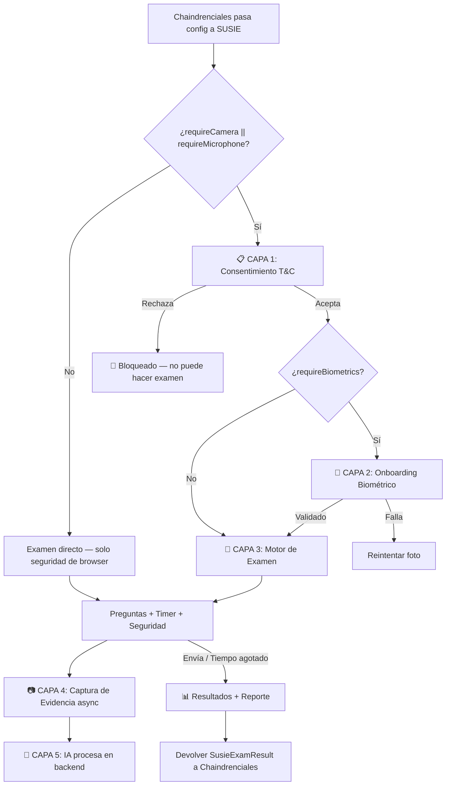

# 🏗️ Arquitectura SUSIE — Motor Completo de Exámenes

> **Fecha:** 16 de Febrero de 2026
> **Autor:** Equipo SUSIE
> **Propósito:** Documento de discusión para alinear al equipo sobre la arquitectura de integración SUSIE ↔ Chaindrenciales

---

## 1. Cambio de Visión

SUSIE **no es solo un overlay de proctoring** que se le pone encima a un examen existente. SUSIE **es el motor completo** que:

1. **Recibe** la configuración del examen desde Chaindrenciales (preguntas, políticas, permisos)
2. **Ejecuta** todo el flujo del examen (consentimiento → biometría → preguntas → timer → envío)
3. **Supervisa** al candidato (cámara, audio, comportamiento del navegador)
4. **Devuelve** los resultados a Chaindrenciales (respuestas + reporte de proctoring)

```mermaid
flowchart LR
    subgraph Chaindrenciales
        A["Reclutador crea examen"] --> B["Asigna a candidato"]
        B --> C["Genera config + preguntas"]
    end
    subgraph SUSIE
        D["Recibe config"] --> E["Consentimiento"]
        E --> F["Biometría"]
        F --> G["Ejecuta examen"]
        G --> H["Captura evidencia"]
        H --> I["Genera reporte"]
    end
    C -->|"Contrato de integración"| D
    I -->|"Resultados + Reporte proctoring"| J["Chaindrenciales recibe"]
```



### ¿Qué pasa con el `StartComponent` actual de Chaindrenciales?

El `StartComponent` que hoy maneja los exámenes en Chaindrenciales **se reemplaza por SUSIE** cuando el examen requiere supervisión. Si un examen NO requiere cámara ni audio, las capas inferiores de SUSIE no se activan y funciona como un examen básico.

---

## 2. Estrategia de Integración: Librería Embebida (npm)

Se evaluaron 3 opciones. **Se recomienda la Estrategia 2:**

| Estrategia | Descripción | Veredicto |
|-----------|-------------|-----------|
| URL Redirect | SUSIE como app separada, Chaindrenciales redirige | ❌ Complejidad de deploy y auth |
| **Librería npm** | Chaindrenciales instala `ngx-susie-proctoring` | ✅ **RECOMENDADA** |
| Iframe | SUSIE embebido en iframe | ❌ Problemas con permisos de cámara |

### Cómo se integra Chaindrenciales

```typescript
// En la app de Chaindrenciales:
import { SusieWrapperComponent } from 'ngx-susie-proctoring';

// En el template:
<susie-wrapper [config]="examConfig" (examFinished)="onExamFinished($event)" />
```

Chaindrenciales solo necesita:
1. Instalar la librería: `npm install ngx-susie-proctoring`
2. Pasar la configuración con preguntas y políticas
3. Escuchar el evento `(examFinished)` para recibir respuestas y reporte

---

## 3. Contratos de Integración

### 3.1 Entrada: Lo que Chaindrenciales le pasa a SUSIE

```typescript
interface SusieExamConfig {
  // — Datos de sesión —
  session: {
    examSessionId: string;       // Correlation ID para trazabilidad
    examId: string;
    assignmentId: number;        // ID de asignación en Chaindrenciales
  };

  // — Preguntas (vienen de Chaindrenciales) —
  questions: SusieQuestion[];

  // — Configuración de tiempo —
  timer: {
    durationMinutes: number;
    autoSubmitOnExpiry: boolean;
  };

  // — Políticas de seguridad —
  security: {
    requireCamera: boolean;
    requireMicrophone: boolean;
    requireFullscreen: boolean;
    requireConsent: boolean;        // T&C obligatorios
    requireBiometrics: boolean;     // Onboarding biométrico
    preventTabSwitch: boolean;
    preventInspection: boolean;
  };

  // — Configuración de captura —
  capture?: {
    snapshotIntervalSeconds: number;
    audioChunkIntervalSeconds: number;
  };

  // — Textos de consentimiento —
  consent?: {
    termsText: string;
    privacyNotice: string;
  };

  // — Conexión con backend SUSIE —
  apiUrl: string;
  authToken: string;
}

interface SusieQuestion {
  id: number;
  content: string;       // HTML o texto de la pregunta
  options: string[];
  // ⚠️ NO incluir correctAnswer — SUSIE no evalúa
}
```

> **⚠️ IMPORTANTE:** SUSIE **nunca** conoce las respuestas correctas. Solo recolecta y supervisa. La evaluación la hace Chaindrenciales al recibir el resultado.

### 3.2 Salida: Lo que SUSIE devuelve a Chaindrenciales

```typescript
interface SusieExamResult {
  // — Respuestas del candidato —
  answers: Record<number, string>;  // { questionId: respuesta }

  // — Reporte de proctoring —
  proctoring: {
    consentGiven: boolean;
    consentTimestamp: string;
    biometricVerified: boolean;
    violations: SecurityViolation[];
    capturedSnapshots: number;
    capturedAudioChunks: number;
  };

  // — Estado final —
  status: 'submitted' | 'cancelled' | 'expired';
  cancellationReason?: string;
}
```

---

## 4. Capas Condicionales — No todo se activa siempre

SUSIE funciona como capas que se activan según la configuración del examen:



| Tipo de examen | Capas activas | Ejemplo |
|---------------|---------------|---------|
| Sin supervisión | Solo Capa 3 | Encuesta interna, quiz rápido |
| Con cámara | Capas 1 + 2 + 3 + 4 + 5 | Certificación profesional |
| Con audio | Capas 1 + 3 + 4 + 5 | Examen con dictado |
| Supervisión completa | Todas las capas | Evaluación de alta seguridad |

---

## 5. Estructura del Monorepo

```
SUSIE/
├── frontend/
│   └── projects/
│       ├── ngx-susie-proctoring/     ← LA LIBRERÍA (el producto)
│       │   └── src/lib/
│       │       ├── components/
│       │       │   ├── susie-wrapper/       ← Orquestador principal
│       │       │   ├── consent-dialog/      ← T&C (Fase 1, por implementar)
│       │       │   ├── exam-engine/         ← UI del examen (Fase 2, migrar desde demo)
│       │       │   └── camera-pip/          ← Preview de cámara
│       │       ├── models/
│       │       │   └── contracts.ts         ← Interfaces del contrato
│       │       └── services/
│       │           ├── media.service.ts     ← Acceso a cámara/micrófono
│       │           ├── evidence.service.ts  ← Envío de evidencia al backend
│       │           └── security.service.ts  ← Protecciones anti-trampas
│       │
│       └── susie-demo/                ← APP DE DESARROLLO (sandbox)
│           └── src/app/               ← Simula a Chaindrenciales con datos dummy
│
├── backend/                           ← API Gateway (Ramírez)
│   └── Fastify + RabbitMQ
│
└── inference_engine/                  ← IA (Vargas)
    └── Python workers (YOLO, DeepFace, Whisper)
```

### Diferencia entre `ngx-susie-proctoring` y `susie-demo`

| | `ngx-susie-proctoring` | `susie-demo` |
|--|------------------------|--------------|
| **¿Qué es?** | La librería npm (el producto) | App de desarrollo (sandbox) |
| **¿Va a producción?** | ✅ Sí, Chaindrenciales la instala | ❌ No, solo para desarrollo |
| **¿Quién la usa?** | Chaindrenciales | Solo el equipo SUSIE para probar |
| **Analogía** | Angular Material (la librería) | La demo app de Angular Material |

---

## 6. Responsabilidades del Equipo

| Rol | Persona | Responsabilidad en la nueva arquitectura |
|-----|---------|------------------------------------------|
| Frontend & Sensores | Vielma | Librería `ngx-susie-proctoring`: componentes, captura, seguridad, UI del examen |
| API Gateway | Ramírez | Recibir evidencia, subirla a Azure, publicar en RabbitMQ, endpoints de integración |
| IA & Modelos | Vargas | Workers de procesamiento: YOLO, DeepFace, MediaPipe, Whisper |

---

## 7. Roadmap de Implementación

| Fase | Qué | Estado |
|------|-----|--------|
| **Fase 1** | Consentimiento T&C (SDSIES-12) | 🔜 Próximo |
| **Fase 2** | Migrar UI del examen a la librería (`ExamEngineComponent`) | 📋 Planeado |
| **Fase 3** | Contrato completo `SusieExamConfig` + `SusieExamResult` | 📋 Planeado |
| **Fase 4** | Onboarding biométrico (foto de referencia) | 📋 Planeado |
| **Fase 5** | Integración con Chaindrenciales (prueba real) | 📋 Planeado |

---

## 8. Preguntas Abiertas para Discusión

1. **¿Cómo se pasan las preguntas a SUSIE?** ¿Chaindrenciales las incluye directamente en el config, o SUSIE las obtiene vía API con un `examId`?
2. **¿Quién guarda las respuestas?** ¿SUSIE las manda al backend de Chaindrenciales, o las devuelve vía evento y Chaindrenciales las guarda?
3. **¿Los textos de T&C son fijos o configurables por examen?**
4. **¿Hay exámenes que requieran cámara pero NO biometría?** (Esto afecta si las capas son independientes)
5. **¿Ramírez necesita exponer algún endpoint nuevo** para que SUSIE devuelva el reporte de proctoring?
