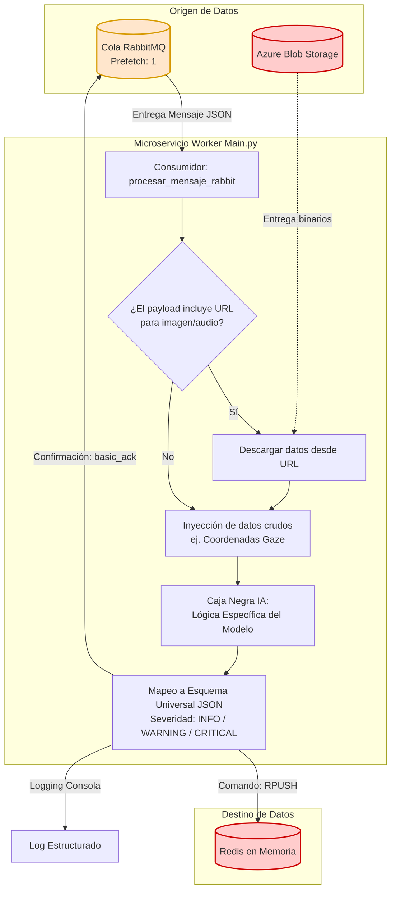
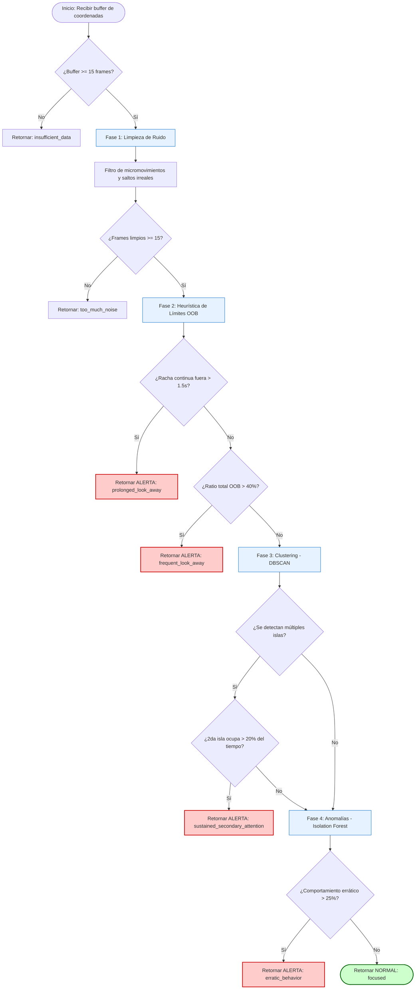
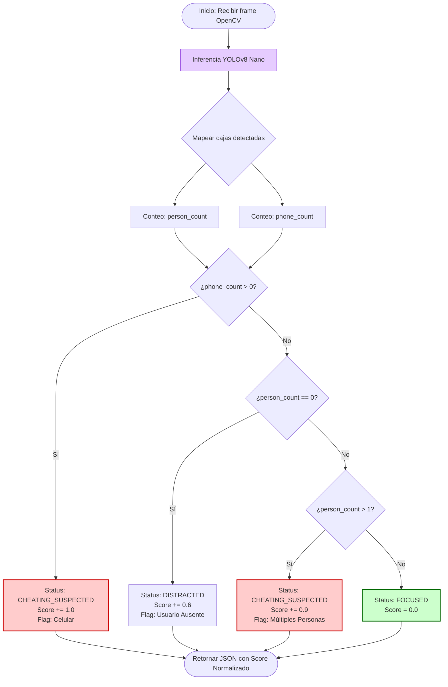
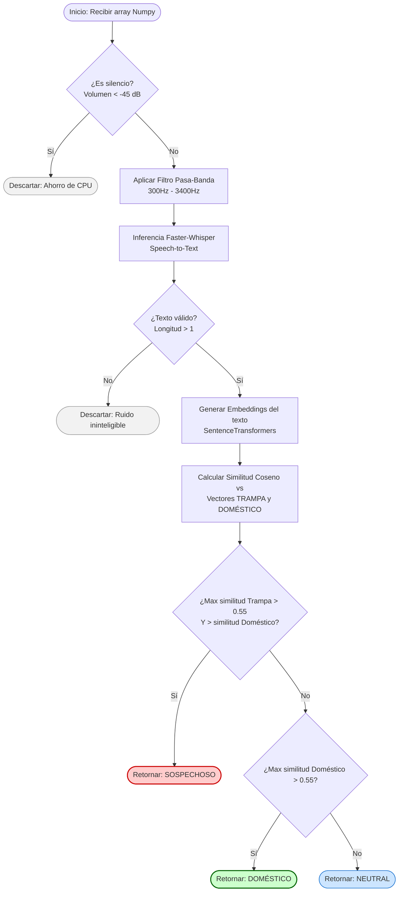
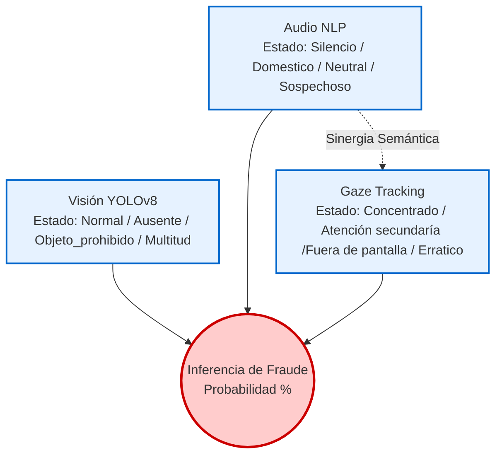

# Arquitectura General del Sistema Multimodal de Proctoring (Enfásis en el apartado de IA)

---

**Justificación del Diseño Orientado a Eventos (Event-Driven Architecture)**

Para garantizar la alta disponibilidad y escalabilidad del sistema de proctoring durante sesiones de evaluación masivas, se descartó el uso de una arquitectura síncrona tradicional (REST APIs). En su lugar, el backend fue diseñado utilizando un patrón de **Trabajadores sin Estado (Stateless Workers)** orquestados mediante **RabbitMQ**.

Esta decisión técnica permite que el frontend no experimente tiempos de espera (*timeouts*) mientras los modelos de Inteligencia Artificial procesan datos pesados (imágenes y audio). Los microservicios operan de forma asíncrona consumiendo tareas de colas específicas con una política de *Prefetch de 1*, lo que asegura que ningún nodo sature su memoria RAM. Finalmente, para evitar cuellos de botella en la escritura de la base de datos, todos los workers unifican sus veredictos en una memoria caché de altísima velocidad (**Redis**), almacenando los logs en formato JSON estructurado bajo una llave única por estudiante y sesión (`proctoring:session_{sessionId}:user_{userId}`).

### Diagrama de flujo de información



---

### 1. Módulo de Seguimiento Ocular (Gaze Tracking)

**Cola de consumo (RabbitMQ):** `gaze_tasks_queue`

**Entrada esperada:** JSON que incluye un arreglo continuo de coordenadas `(x, y)` recolectadas por el frontend.

**Descripción del Flujo Lógico:**

El análisis de la mirada no se evalúa frame por frame, ya que esto generaría una cantidad inmanejable de falsos positivos debido a los movimientos sacádicos naturales del ojo humano. El pipeline aplica un análisis espacial y temporal dividido en cuatro capas:

1. **Filtro de Ruido:** Se calcula la distancia euclidiana entre coordenadas consecutivas. Saltos física o anatómicamente imposibles en menos de 50ms se descartan como errores del tracker o parpadeos.
2. **Heurística de Tolerancia:** En lugar de penalizar cualquier desviación, el sistema mide "Rachas de Distracción". Un vistazo rápido al reloj es ignorado, pero un tiempo continuo mayor a 1.5 segundos fuera de la pantalla dispara una alerta.
3. **Clustering de Atención Sostenida:** Utilizando el algoritmo de Machine Learning **DBSCAN** (Density-Based Spatial Clustering), el sistema agrupa los puntos de la mirada para encontrar "islas" de atención. Se aplica una regla de negocio que permite clústeres secundarios pequeños (ej. mirar el botón de "Siguiente"), pero alerta si una zona periférica acapara más del 20% del tiempo analizado (indicador de un acordeón o notas físicas).
4. **Análisis de Dispersión:** Se emplea **Isolation Forest** para detectar anomalías globales en el comportamiento. Atrapa patrones de mirada errática o nerviosa que no logran formar clústeres definidos.

### Diagrama de logica de Gaze Tracking



---

### 2. Módulo de Visión Computacional (YOLOv8)

**Cola de consumo (RabbitMQ):** q_snapshots

**Entrada esperada:** JSON con la URL de la imagen del estudiante (previamente almacenada en Azure Blob Storage por el backend principal).

**Descripción del Flujo Lógico:**

Este microservicio emplea la red neuronal convolucional YOLOv8 (versión Nano) para garantizar inferencias rápidas consumiendo el mínimo de recursos computacionales. El flujo aplica un sistema de puntuación de sospecha (Suspicion Score) basado en políticas de evaluación estrictas:

- **Tolerancia Cero a Dispositivos:** La detección de la clase `cellphone` (celular) con una confianza superior al 45% escala automáticamente el evento a estado CRÍTICO (Score 1.0).
- **Ausencia de Usuario:** Si el modelo detecta `0` personas en el encuadre, no se asume trampa inmediata, sino una anomalía de estado (DISTRACTED / Score 0.6), ya que el estudiante pudo haber ido al baño o caído de la silla.
- **Múltiples Individuos:** La presencia de `> 1` persona en el encuadre (compañeros soplando respuestas) se clasifica como CRÍTICA (Score 0.9).

### Diagrama de lógica de Computational Vision



---

### 3. Módulo de Análisis de Audio (NLP Multimodal)

**Cola de consumo (RabbitMQ):** q_audios 

**Entrada esperada:** JSON con la URL del fragmento de audio (Azure Blob Storage).

**Descripción del Flujo Lógico:**

Para procesar el audio de forma eficiente, el sistema ejecuta un pre-procesamiento antes de invocar a los modelos de Lenguaje Natural (NLP).

1. **Filtro de Espectro y Silencio:** Se aplica un filtro pasa-banda de Butterworth (300Hz - 3400Hz) para aislar exclusivamente las frecuencias de la voz humana, mitigando ruido blanco o estática de micrófonos de baja calidad. Si el volumen RMS (Root Mean Square) cae por debajo de -45dB, el pipeline se detiene tempranamente para ahorrar ciclos de CPU.
2. **Transcripción (STT):** Se emplea Faster-Whisper con parámetros de VAD (Voice Activity Detection) para transcribir el audio a texto.
3. **Análisis Semántico de Intenciones:** El texto resultante se transforma en vectores matemáticos (Embeddings) usando `SentenceTransformers`. El motor calcula la similitud coseno de la frase del alumno contra un dataset preclasificado, permitiendo diferenciar con alta precisión entre un ruido doméstico justificable (ej. *"mamá, cierra la puerta"*) y un intento de colaboración ilícita (ej. *"pásame la respuesta dos"*).

### Diagrama de lógica de procesamiento de audio



---

### Notas Técnicas de Integración (Para el equipo de Desarrollo)

Para que el motor de inferencia (Red Bayesiana) funcione correctamente al final del examen, **el equipo de Frontend y el orquestador de RabbitMQ deben respetar los siguientes lineamientos:**

1. **El Payload Universal de RabbitMQ:** Todos los mensajes enviados a las colas `gaze_tasks_queue`, q_snapshotsy q_audios DEBEN incluir obligatoriamente los campos `"student_id"` y `"session_id"`. Sin estos campos, los workers no sabrán en qué lista de Redis guardar el evento.
2. **Descarga de Azure:** Los microservicios de Visión y Audio asumen que las URLs enviadas en el payload son públicas o incluyen su respectivo token SAS (Shared Access Signature). El worker intentará descargar el archivo; si el servidor devuelve un error 403 (Prohibido) o 404 (No encontrado), el análisis será abortado.
3. **El Veredicto en Redis:** Al finalizar el examen, el Motor de Inferencia solo necesita hacer una consulta `LRANGE proctoring:session_{session_id}:user_{student_id} 0 -1` a Redis. Esto devolverá un arreglo temporal ordenado de todos los eventos del examen en formato JSON. El motor solo debe buscar la etiqueta `"severity": "CRITICAL"` o `"severity": "WARNING"` sin importar de qué sensor provino la alerta, simplificando drásticamente el cálculo de las probabilidades condicionales en la Red Bayesiana.

---

### Diseño del motor de inferencia de logica abductiva

> Para la toma de decisiones final del sistema de *proctoring*, se descartó el uso de árboles de decisión rígidos debido a su alta propensión a generar falsos positivos. En su lugar, se implementó una Red Bayesiana que permite la fusión de datos multimodales manejando la incertidumbre inherente de los modelos predictivos.
> 
> 
> La topología de la red establece la variable "Fraude Académico" dependiente de tres nodos de evidencia observable: Visión Computacional (YOLOv8), Análisis Semántico de Audio (Whisper + SentenceTransformers) y Seguimiento Ocular (Isolation Forest/DBSCAN). Las Tablas de Probabilidad Condicional (CPT) fueron calibradas para penalizar y recompensar sinergias conductuales. Por ejemplo, el sistema aborda el desafío del "auto-habla" (pensar en voz alta): si el modelo NLP clasifica un audio como altamente sospechoso por su contenido técnico, pero el modelo de Gaze Tracking reporta una fijación sostenida en el centro de la pantalla, la red Bayesiana infiere condicionalmente que el estudiante está leyendo el examen en voz alta, reduciendo la probabilidad de fraude de un 92% a un 25%.
> 
> Por el contrario, si la detección semántica sospechosa coexiste con una desviación ocular errática reportada por el modelo de Isolation Forest, la red dispara la probabilidad de trampa al 92%, deduciendo la comunicación con un tercero fuera del encuadre. Este enfoque estocástico garantiza un sistema de supervisión ético y estadísticamente justificable.
> 



**La Tabla de Probabilidad Condicional (CPT)**
Esta tabla define el comportamiento matemático de tu nodo central. Muestra la probabilidad $P(\text{Trampa} \mid V, A, G)$. Los porcentajes están asignados considerando las precisiones reportadas en la literatura que vimos antes y la lógica de negocio de tus scripts.

### 1. Nodo de Visión Computacional (YOLOv8)

Refleja lo que ocurre físicamente en el entorno del estudiante capturado por la cámara.

- **`Normal`**: Un solo estudiante detectado en el encuadre, sin dispositivos sospechosos (Score: 0.0).
- **`Ausente`**: Cero personas detectadas en el encuadre; posible abandono temporal (Score: 0.6).
- **`Objeto_Prohibido`**: Detección positiva de la clase *cellphone* con confianza > 45% (Score: 1.0).
- **`Multitud`**: Detección de más de una persona en el encuadre; posible asistencia de un tercero (Score: 0.9).

### 2. Nodo de Análisis de Audio (NLP Multimodal)

Clasifica la naturaleza del sonido ambiente y la intención semántica de las palabras detectadas.

- **`Silencio`**: Volumen RMS por debajo de -45dB; el análisis se aborta para ahorrar CPU.
- **`Neutral`**: Ruido ininteligible o palabras sueltas sin suficiente contexto para generar un embedding válido.
- **`Doméstico`**: Similitud coseno alta con el dataset de ruidos o interacciones de hogar justificables (ej. interrupciones de familiares).
- **`Sospechoso`**: Similitud coseno alta con el dataset de trampa; frases técnicas, dictado de preguntas o solicitud de respuestas.

### 3. Nodo de Seguimiento Ocular (Gaze Tracking)

Evalúa el comportamiento espacial y temporal de la mirada, filtrando movimientos naturales.

- **`Concentrado`**: Mirada predominantemente en la pantalla, formando un clúster principal sin anomalías globales.
- **`Fuera_de_Pantalla`**: Racha continua fuera de los límites de la pantalla mayor a 1.5 segundos, o ratio total fuera de límites > 40%.
- **`Atención_Secundaria`**: El algoritmo DBSCAN detecta una "isla" de atención periférica (ej. un acordeón físico) que acapara más del 20% del tiempo analizado.
- **`Errático`**: El modelo *Isolation Forest* detecta un comportamiento anómalo (> 25%), indicando nerviosismo o búsqueda visual desestructurada sin formar clústeres.

### 4. Nodo Objetivo (Inferencia)

El resultado calculado por la Red Bayesiana tras cruzar las probabilidades condicionales de los tres nodos anteriores.

- **`Fraude Académico`**: Se expresa como un valor porcentual de probabilidad (0% al 100%) que posteriormente se pueden traducir a las etiquetas de severidad para los log en Redis (`INFO`, `WARNING`, `CRITICAL`).

---

| **Visión (YOLO)** | **Audio (Whisper+NLP)** | **Mirada (Gaze Tracking)** | **P(Trampa)** | **Justificación de la Inferencia** |
| --- | --- | --- | --- | --- |
| Objeto_Prohibido | Cualquiera | Cualquiera | 99% | Tolerancia Cero: Celular detectado en cámara. Fraude inminente. |
| Multitud | Cualquiera | Cualquiera | 90% | Intervención de Terceros: Más de una persona en el encuadre. |
| Normal | **Sospechoso** | **Errático** | **92%** | **Sinergia:** Nerviosismo visual (Isolation Forest) coordinado con lenguaje sospechoso. |
| Normal | **Sospechoso** | Concentrado | **25%** | **Atenuante:** Pensando en voz alta. Vista en el examen, aunque el texto sea técnico. |
| Normal | **Doméstico** | Fuera_de_Pantalla | **15%** | **Atenuante:** Voltea a la puerta para hablar con un familiar ("cierra la puerta"). El NLP salva al alumno de un falso positivo temporal. |
| Ausente | **Sospechoso** | *Irrelevante* | **85%** | Estudiante oculto dictando/preguntando. |
| Ausente | Silencio / Doméstico | *Irrelevante* | **50%** | Posible abandono o ida al baño no autorizada. Requiere revisión, no es fraude confirmadísimo. |
| Normal | Silencio | **Errático** | **45%** | Nerviosismo visual sin audio. Sospechoso pero inconcluso. |
| Normal | Neutral / Silencio | Concentrado | **1%** | Comportamiento ideal. |

### Justificación de valores

### 1. Para justificar la Red Bayesiana (El Motor de Inferencia)

Aunque la mayoría de los sistemas comerciales usan reglas rígidas (`if/else`), la academia respalda el uso de modelos probabilísticos  para evitar falsos positivos.

- **"Dynamic Bayesian Approach for Detecting Cheats in Multi-Player Online Games"**: Aunque este estudio se enfoca en detectar trampas (bots) en videojuegos en línea, demuestra matemáticamente por qué una **Red Bayesiana Dinámica (DBN)** es superior a las reglas estáticas. Los autores concluyen que este enfoque permite detectar trampas basándose en el comportamiento a lo largo del tiempo con una tasa de falsos positivos extremadamente baja. De esta manera se demuestra que el modelo propuesto no evalúa alertas aisladas, sino la probabilidad acumulada temporalmente.
- **"INTEGRITY GAURD: An AI-Driven Proctoring System for Fair Online Examinations"**: Este estudio de 2025 introduce un marco multimodal (mirada, audio, objetos) que utiliza "modelos de fusión ponderada" para reducir sesgos y falsas alarmas. Es exactamente lo que hace tu Red Bayesiana al cruzar YOLO con Whisper y Gaze Tracking.

Referencias

- **Yeung, S. F., & Lui, J. C. (2008).** Dynamic Bayesian approach for detecting cheats in multi-player online games. *Multimedia Systems*, 14, 221-236.
    - **Enlace:** [https://www.cse.cuhk.edu.hk/~cslui/PUBLICATION/mmsj_tr.pdf](https://www.cse.cuhk.edu.hk/~cslui/PUBLICATION/mmsj_tr.pdf)
    - **DOI:** https://www.google.com/search?q=https://doi.org/10.1007/s00530-008-0136-1
- **Mishra, A., et al. (2025).** INTEGRITY GAURD: An AI-Driven Proctoring System for Fair Online Examinations. *International Journal for Research in Applied Science and Engineering Technology (IJRASET)*, 13(1).
    - **Enlace:** [https://www.ijraset.com/research-paper/ai-driven-proctoring-system-for-fair-online-examinations](https://www.ijraset.com/research-paper/ai-driven-proctoring-system-for-fair-online-examinations)

### 2. Para justificar el Gaze Tracking (WebGazer + Isolation Forest)

- **"Smart Online Examination Cheat detection using Gaze Analysis" (Diciembre 2024)**: Los investigadores utilizaron exactamente un modelo de **Isolation Forest** para extraer anomalías en datos de alta dimensionalidad y discriminar entre la mirada estándar y la sospechosa. Aún mejor: concluyeron que para evitar que el sistema sea sensible a parpadeos o "vistazos breves", los valores atípicos que duran **menos de un segundo** deben ser eliminados, ya que no corresponden a deshonestidad intencional. Esto justifica perfectamente la regla de ignorar "Out of Bounds" menores a 1.5 segundos.
- **"Cheating Detection in Browser-based Online Exams through Eye Gaze Tracking"**: Utiliza la librería *WebGazer*  combinada con algoritmos de detección de anomalías (One-Class SVM, muy similar a Isolation Forest). Señalan que el 73% de los estudiantes hacen trampa en exámenes en línea sin supervisión.

**Probabilidades para la Red Bayesiana (Gaze):** La literatura muestra que los modelos de seguimiento ocular por sí solos (como análisis de postura de cabeza y mirada) alcanzan precisiones entre el **87% y el 96.04%**. Si tu Gaze Tracking lanza "CRITICAL", puede asignarse un **~85-90%** de probabilidad de trampa en el nodo.

Referencias

- **Bhat, S., et al. (2024).** Smart Online Examination Cheat detection using Gaze Analysis. *2024 IEEE North Karnataka Subsection Flagship International Conference (NKCon)*.
    - **Enlace / DOI:** [https://ieeexplore.ieee.org/document/10774949/](https://ieeexplore.ieee.org/document/10774949/) ó [https://doi.org/10.1109/NKCon62837.2024.10774949](https://www.google.com/search?q=https://doi.org/10.1109/NKCon62837.2024.10774949)
- **Perera, I., et al. (2021).** Cheating Detection in Browser-based Online Exams through Eye Gaze Tracking. *2021 6th International Conference on Information Technology Research (ICITR)*.
    - **Enlace / DOI:** [https://ieeexplore.ieee.org/document/9657277](https://ieeexplore.ieee.org/document/9657277) ó https://doi.org/10.1109/ICITR54349.2021.9657277

### 3. Para justificar la Visión Computacional (YOLO)

- **"Deep Learning Models for Detecting Cheating in Online Exams"**: Este estudio evaluó modelos de detección de objetos en exámenes en línea. Demostraron que la familia YOLO (ellos usaron YOLOv5 y YOLOv10) alcanzó una precisión del **95.54%** al **95.66%** identificando conductas deshonestas.
- **"Deep Learning-Based Multimodal Cheating Detection in Online Proctored Exams" (Diciembre 2024)**: Destacan que la combinación de seguimiento de mirada con detección de objetos (celulares, personas no autorizadas) en tiempo real logra minimizar fuertemente los falsos positivos y negativos.

**Probabilidades para la Red Bayesiana (YOLO):** Si el modelo YOLO detecta un `cellphone` o múltiples personas, basándose en estos estudios, se puede justificar en la tabla de probabilidad (CPT) un impacto de **95% de certeza** de trampa inminente.

Referencias

- **Essahraui, S., et al. (2025).** Deep Learning Models for Detecting Cheating in Online Exams. *Computers, Materials & Continua (CMC)*, 85(2).
    - **Enlace:** [https://www.techscience.com/cmc/v85n2/63822](https://www.techscience.com/cmc/v85n2/63822)
    - **DOI:** [https://doi.org/10.32604/cmc.2025.063822](https://www.google.com/search?q=https://doi.org/10.32604/cmc.2025.063822)
- **Lamba, S., & Sharma, N. (2024).** Deep Learning-Based Multimodal Cheating Detection in Online Proctored Exams. *Journal of Electrical Systems*, 20(3).
    - **Enlace:** [https://journal.esrgroups.org/jes/article/view/7480](https://journal.esrgroups.org/jes/article/view/7480)

### 4. Para justificar el Audio y Análisis Semántico

- **"AutoOEP - A Multi-modal Framework for Online Exam Proctoring" (Septiembre 2025)**: Critica fuertemente los sistemas que evalúan el fraude "frame por frame", ya que se pierden comportamientos complejos y dependientes del tiempo. Esto justifica por qué se acumula el audio en *chunks* y posteriormente se analiza semánticamente.
- **"Cheating activity detection on secure online mobile exam"**: Resalta que la extracción de voz y la detección de audios es una de las pistas más fuertes para el reconocimiento de actividades de trampa. Sus modelos que incluyen audio alcanzan un **91.73%** de precisión.

Referencias

- **Kashyap Naveen, A., et al. (2025).** AutoOEP - A Multi-modal Framework for Online Exam Proctoring. *arXiv preprint*.
    - **Enlace / DOI:** [https://arxiv.org/abs/2509.10887](https://arxiv.org/abs/2509.10887) ó [https://doi.org/10.48550/arXiv.2509.10887](https://www.google.com/search?q=https://doi.org/10.48550/arXiv.2509.10887)
- **Setyanto, A., Setiaji, B., & Hayaty, M. (2020).** Cheating activity detection on secure online mobile exam. *Journal of Engineering Science and Technology (JESTEC)*, 15(6).
    - **Enlace:** [https://jestec.taylors.edu.my/Vol%2015%20issue%206%20December%202020/15_6_34.pdf](https://jestec.taylors.edu.my/Vol%2015%20issue%206%20December%202020/15_6_34.pdf)

---

### 5. Generación del Dictamen Final (Evaluación Temporal e Híbrida)

Para la toma de decisión final sobre la integridad del examen, el sistema no calcula un "promedio global" de las probabilidades obtenidas durante la sesión. Un promedio aritmético presenta un riesgo crítico en el contexto del proctoring: puede diluir y ocultar un evento de fraude explícito (ej. sacar un celular durante 30 segundos con un 99% de probabilidad) si el estudiante mantiene un comportamiento ideal (1%) durante el resto de una sesión de dos horas.

Para resolver este desafío y entregar una herramienta verdaderamente auditable, el Motor de Inferencia procesa la lista ordenada de eventos en Redis (`LRANGE`) implementando un **Sistema Híbrido de Dictamen** compuesto por tres ejes de evaluación:

**A. Línea de Tiempo de Probabilidad (Visualización para Auditoría)**

Se mapea cada evento generado por los workers en un eje cartesiano, donde **X** representa el `timestamp` (tiempo transcurrido de la sesión) e **Y** representa la probabilidad de fraude calculada por la Red Bayesiana.

Esta serialización temporal es enviada al Frontend para renderizar una gráfica interactiva. Esto permite a los profesores o auditores hacer clic directamente en los "picos de sospecha" y revisar el segmento exacto de video o audio, eliminando la necesidad de visualizar la grabación completa.

**B. Gatillos de Eventos Críticos (Regla de Muerte Súbita)**

El motor realiza una búsqueda de valores máximos absolutos en el arreglo temporal. Si en cualquier instante de la sesión la Red Bayesiana emite una probabilidad $\ge 90\%$ (causada por evidencia contundente como detección de objetos prohibidos, múltiples personas o una sinergia grave de audio/mirada), el estado global del examen cambia inmediatamente a **`REVISIÓN_OBLIGATORIA`**. El sistema aísla este evento y lo adjunta como la "Evidencia Principal".

**C. Índice de Fricción Acumulada (Para Eventos Ambigüos)**

Para manejar la incertidumbre de los eventos con probabilidad media (ej. 45% por comportamiento visual errático sin audio, o 50% por una posible caída de conexión/abandono), el sistema utiliza un puntaje acumulativo.

Cada evento que recae en el rango de 40% a 85% de probabilidad suma puntos a un "Índice de Fricción". Si un estudiante acumula un puntaje superior a un umbral predefinido (indicando una repetición constante de comportamientos inusuales, aunque no críticos por sí solos), el examen se clasifica como **`REVISIÓN_SUGERIDA`**.

Si la sesión concluye sin gatillos críticos y con una fricción mínima, el dictamen automático es **`APROBADO_CON_INTEGRIDAD`**.

### Estructura del Payload de Dictamen (Salida del Motor de Inferencia)

El resultado procesado por la Red Bayesiana se empaqueta en el siguiente esquema JSON universal para ser consumido por el Dashboard del Frontend:

```jsx
{
  "student_id": "2032XXXX",
  "session_id": "exam_final_redes_01",
  "dictamen_status": "REVISIÓN_OBLIGATORIA",
  "metrics": {
    "critical_flags_count": 1,
    "accumulated_friction_score": 45
  },
  "primary_evidence": {
    "timestamp": "00:45:20",
    "justification": "Sinergia: Nerviosismo visual coordinado con lenguaje sospechoso",
    "probability_score": 0.88
  },
  "timeline_data": [
    {"time": "00:10:05", "probability": 0.01, "event_context": "Comportamiento Ideal"},
    {"time": "00:25:30", "probability": 0.45, "event_context": "Anomalía Visual Aislada"},
    {"time": "00:45:20", "probability": 0.88, "event_context": "Audio Sospechoso + Gaze Errático"}
  ]
}
```