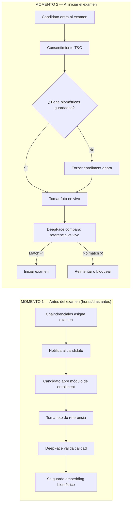
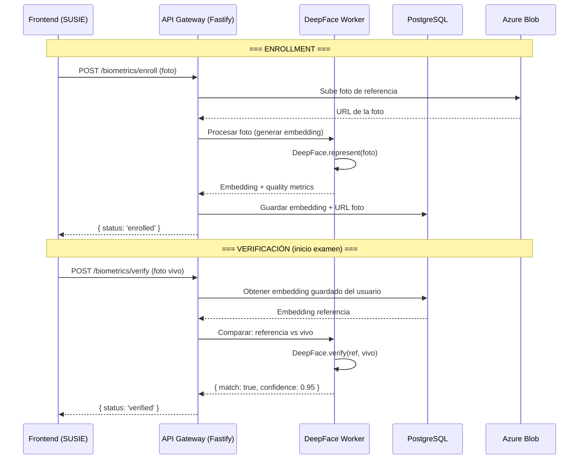
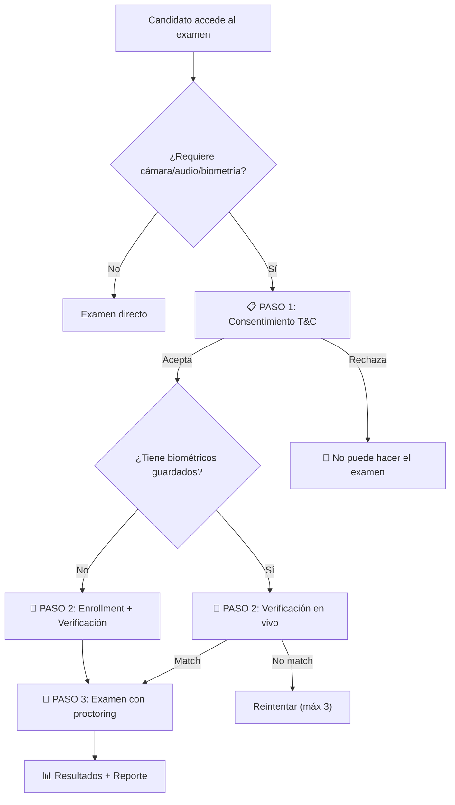
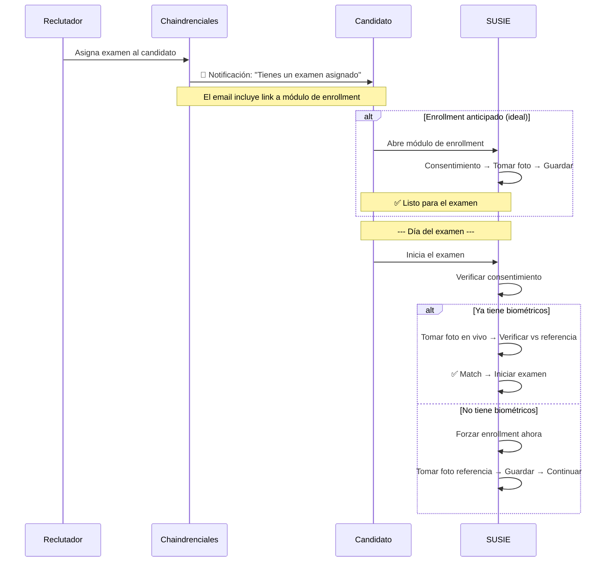

# 🔐 Flujo Biométrico — Enrollment y Verificación con DeepFace

> **Fecha:** 16 de Febrero de 2026
> **Propósito:** Diseño del flujo completo de biometría facial para SUSIE

---

## 1. Visión General

El flujo biométrico tiene **dos momentos** separados en el tiempo:



---

## 2. ¿Qué es el Embedding Biométrico?

DeepFace no guarda la foto directamente. Genera un **embedding** — un vector numérico (ej: 128 dimensiones) que representa matemáticamente el rostro. Es como una "huella digital" del rostro.

```
Foto del candidato → DeepFace → [0.023, -0.156, 0.891, ...] (128 números)
```

Para verificar identidad, DeepFace compara embeddings:

```
Embedding guardado (referencia):  [0.023, -0.156, 0.891, ...]
Embedding en vivo (examen):       [0.025, -0.152, 0.888, ...]
Distancia coseno: 0.02 → ✅ Es la misma persona (umbral < 0.4)
```

> **⚠️ Privacidad:** Los embeddings no se pueden revertir a la foto original. Es más seguro que guardar fotos.

---

## 3. Endpoints Necesarios

### 3.1 Enrollment (Registro biométrico)

Endpoint **síncrono** — el candidato necesita feedback inmediato.

```
POST /api/v1/biometrics/enroll
```

```typescript
// Request (multipart/form-data)
{
  userId: string,           // ID del candidato en Chaindrenciales
  referencePhoto: File,     // Foto del rostro
}

// Response (éxito)
{
  status: 'enrolled',
  biometricId: 'bio_abc123',
  quality: {
    faceDetected: true,
    faceCount: 1,           // Debe ser exactamente 1
    confidence: 0.97,
    frontal: true,           // Rostro de frente, no de perfil
  },
  enrolledAt: '2026-02-16T00:30:00Z',
}

// Response (error)
{
  status: 'error',
  reason: 'NO_FACE_DETECTED' | 'MULTIPLE_FACES' | 'LOW_QUALITY' | 'NOT_FRONTAL',
  message: 'No se detectó un rostro claro. Asegúrate de estar en un lugar bien iluminado.',
}
```

**¿Por qué síncrono y no async?** Porque el candidato está esperando para saber si su foto fue aceptada. No tiene sentido mandar a una cola de RabbitMQ aquí — necesita respuesta inmediata.

### 3.2 Verificación (Al iniciar examen)

Endpoint **síncrono** — bloquea el inicio del examen hasta verificar.

```
POST /api/v1/biometrics/verify
```

```typescript
// Request (multipart/form-data)
{
  userId: string,
  examSessionId: string,
  livePhoto: File,           // Foto tomada en el momento
}

// Response (éxito)
{
  status: 'verified',
  match: true,
  confidence: 0.95,          // Qué tan seguro está
  verifiedAt: '2026-02-16T01:00:00Z',
}

// Response (no match)
{
  status: 'rejected',
  match: false,
  confidence: 0.23,
  reason: 'FACE_MISMATCH',
  message: 'El rostro no coincide con el registro biométrico.',
  retriesRemaining: 2,       // Intentos restantes
}
```

### 3.3 Consultar estado de enrollment

Para saber si el candidato ya tiene biométricos guardados.

```
GET /api/v1/biometrics/status/:userId
```

```typescript
// Response
{
  enrolled: true | false,
  enrolledAt: '2026-02-16T00:30:00Z' | null,
  biometricId: 'bio_abc123' | null,
}
```

---

## 4. Flujo por Capas (quién hace qué)



### ¿Por qué NO usar RabbitMQ para biométricos?

Los biométricos requieren respuesta **síncrona** (el candidato espera). RabbitMQ es para procesamiento **asíncrono** (fire & forget). Son dos patrones distintos:

| Tipo | Patrón | Ejemplo |
|------|--------|---------|
| Biometría | Síncrono (request/response) | Enrollment, Verificación |
| Evidencia de examen | Asíncrono (fire & forget → RabbitMQ) | Snapshots, Audio chunks |

**Solución:** El Gateway llama **directamente** al worker de DeepFace (HTTP o gRPC), no por cola.

---

## 5. Base de Datos — Modelo nuevo

Se necesita agregar al schema de Prisma:

```prisma
model BiometricRecord {
  id              Int       @id @default(autoincrement())
  userId          String    // ID del usuario en Chaindrenciales
  biometricId     String    @unique @default(uuid())
  embedding       Json      // Vector de embedding (ej: [0.023, -0.156, ...])
  referencePhotoUrl String  // URL en Azure Blob de la foto de referencia
  quality         Json      // Métricas de calidad { confidence, frontal, faceCount }
  enrolledAt      DateTime  @default(now())
  updatedAt       DateTime  @updatedAt

  verifications   BiometricVerification[]

  @@index([userId])
}

model BiometricVerification {
  id              Int       @id @default(autoincrement())
  biometricId     String
  examSessionId   String
  matched         Boolean
  confidence      Float
  livePhotoUrl    String    // URL de la foto tomada en el momento
  verifiedAt      DateTime  @default(now())

  biometric       BiometricRecord @relation(fields: [biometricId], references: [biometricId])

  @@index([examSessionId])
}
```

---

## 6. ¿Dónde entra el Consentimiento?

El consentimiento va **antes** de todo — incluyendo biométricos.



El texto de consentimiento debe incluir:
- Que se capturará su rostro para verificación de identidad
- Que se generará un embedding biométrico (no se guarda la foto cruda, solo el vector)
- Que se monitoreará cámara y/o audio durante el examen
- Que los datos se usan exclusivamente para supervisión del examen

---

## 7. Flujo de Notificación Pre-Examen



---

## 8. Preguntas para el Equipo

1. **Ramírez (Backend):** ¿El Gateway llama directamente al worker de DeepFace por HTTP, o prefieres un microservicio separado para biometría?
2. **Vargas (IA):** ¿Qué modelo de DeepFace usar para los embeddings? (`VGG-Face`, `Facenet`, `ArcFace`) — ArcFace tiene mejor precisión pero es más pesado.
3. **Todos:** ¿El enrollment puede hacerse desde la app móvil de Chaindrenciales también, o solo desktop?
4. **Todos:** ¿Cuántos intentos de verificación permitimos antes de bloquear? (sugerencia: 3)
5. **Todos:** ¿Necesitamos "liveness detection" (detectar si es una foto de una foto) o eso viene después?
