# 🔄 Flujo Completo SUSIE — De Punta a Punta

> **Fecha:** 20 de Febrero de 2026  
> **Propósito:** Documentar el ciclo de vida completo de un examen supervisado, desde su creación hasta la entrega de resultados.

---

## Vista General

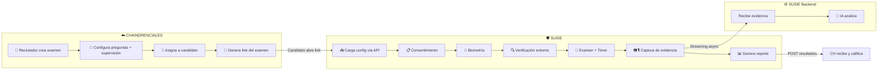

---

## Fase 1: Creación del Examen (Chaindrenciales)

> **Actor:** Reclutador en el dashboard de RH

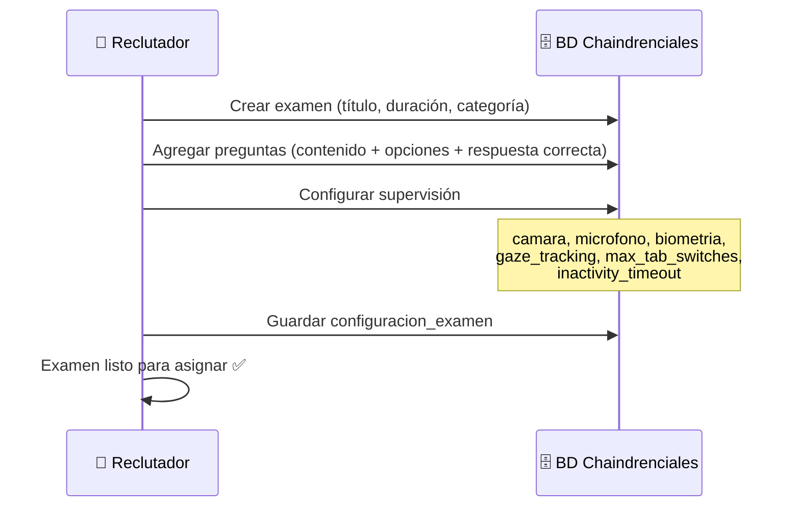

### Tablas involucradas
| Tabla | Qué se guarda |
|-------|--------------|
| `examenes` | Título, duración, tipo, categoría |
| `preguntas` | Contenido, opciones 1-4, respuesta correcta |
| `configuracion_examen` | Los 6 campos de supervisión |

---

## Fase 2: Asignación al Candidato (Chaindrenciales)

> **Actor:** Reclutador asigna un candidato a una evaluación

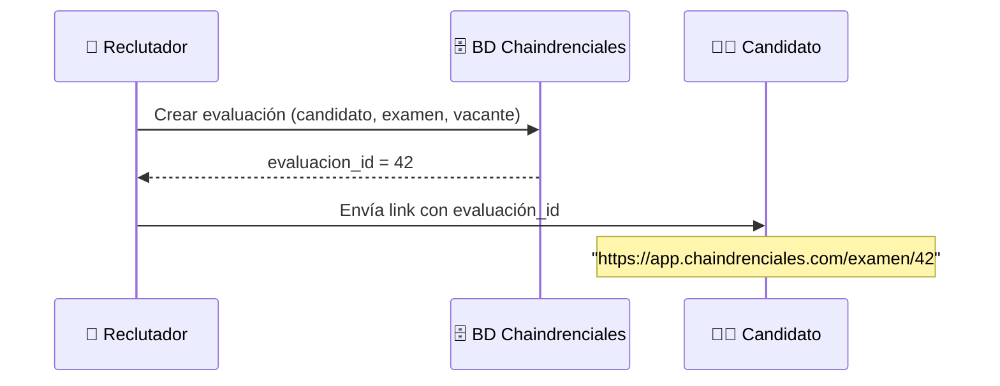

---

## Fase 3: Candidato Abre el Examen (Frontend)

> **Actor:** Candidato hace clic en el link

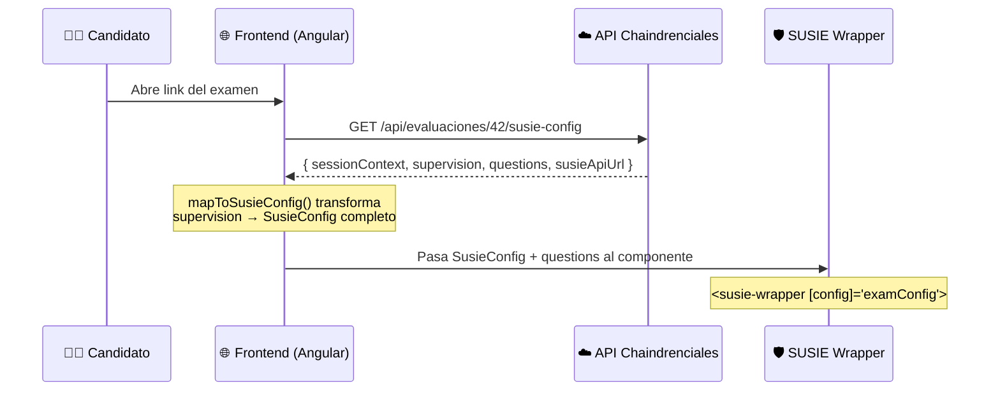

---

## Fase 4: Flujo Interno de SUSIE (Frontend)

> **Actor:** SUSIE Wrapper orquesta las capas condicionalmente

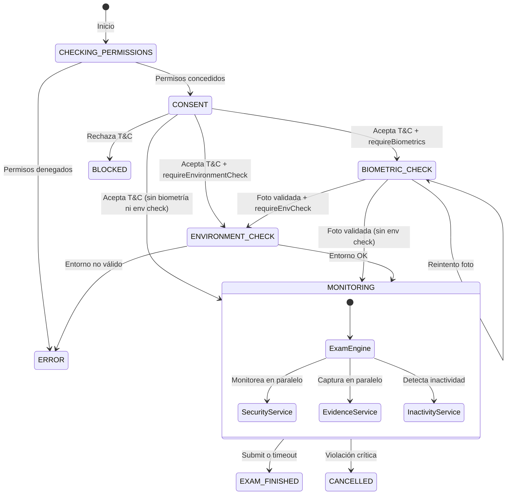

### Detalle de cada estado

| Estado | Componente | Condición de activación | Qué hace |
|--------|-----------|------------------------|----------|
| **CHECKING_PERMISSIONS** | `SusieWrapper` | Siempre (si cámara o micrófono) | Solicita permisos del navegador |
| **CONSENT** | `ConsentDialog` | `requireConsent` (derivado si cámara/micro/bio) | Muestra T&C, el candidato acepta o rechaza |
| **BIOMETRIC_CHECK** | `BiometricOnboarding` | `requireBiometrics = true` | Captura foto de referencia del candidato |
| **ENVIRONMENT_CHECK** | `EnvironmentCheck` | `requireEnvironmentCheck` (derivado si cámara) | Verifica iluminación y entorno |
| **MONITORING** | `ExamEngine` + servicios | Siempre | Examen activo con supervisión |

---

## Fase 5: Examen en Curso (MONITORING)

> **Actores:** ExamEngine + SecurityService + EvidenceService corriendo en paralelo

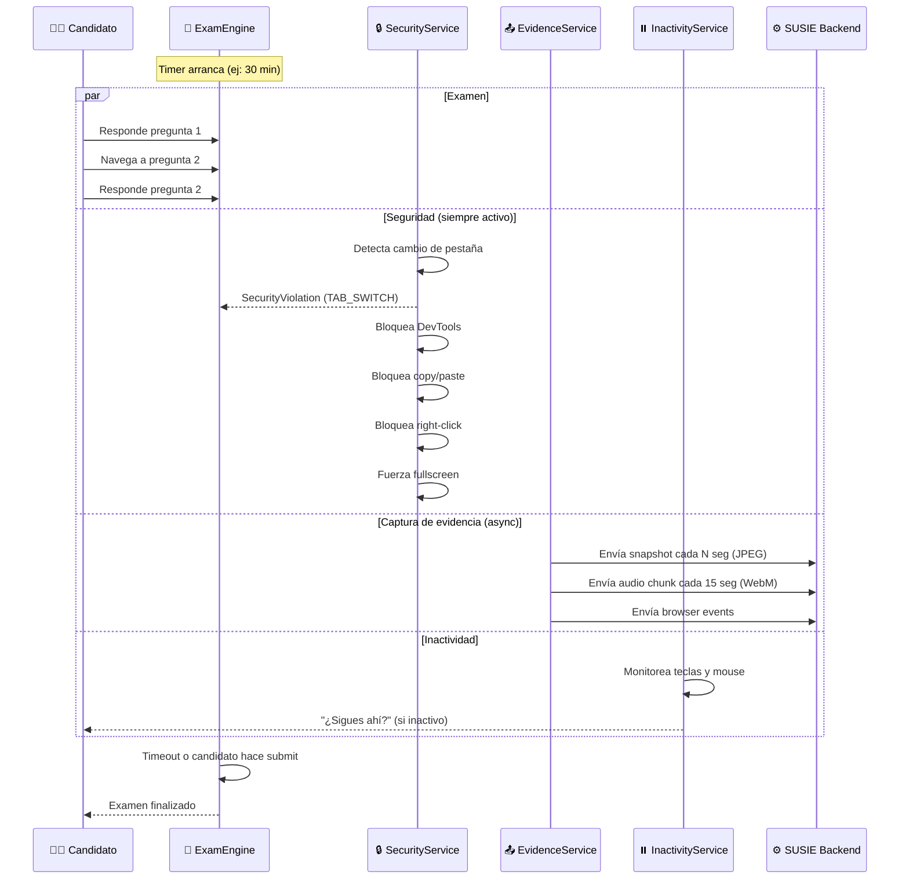

### Servicios activos durante MONITORING

| Servicio | Archivo | Responsabilidad |
|----------|---------|----------------|
| `ExamEngine` | `exam-engine.component.ts` | Preguntas, paginación, timer, submit |
| `SecurityService` | `security.service.ts` | Detectar tab switches, bloquear DevTools, fullscreen |
| `EvidenceService` | `evidence.service.ts` | Enviar snapshots + audio al backend SUSIE |
| `InactivityService` | `inactivity.service.ts` | Alertar si el candidato no interactúa |
| `MediaService` | `media.service.ts` | Stream de cámara/micrófono |
| `NetworkMonitorService` | `network-monitor.service.ts` | Detectar pérdida de conexión |

---

## Fase 6: Backend SUSIE — Procesamiento de Evidencia

> **Actor:** Backend SUSIE (Fastify + RabbitMQ + Python Workers)

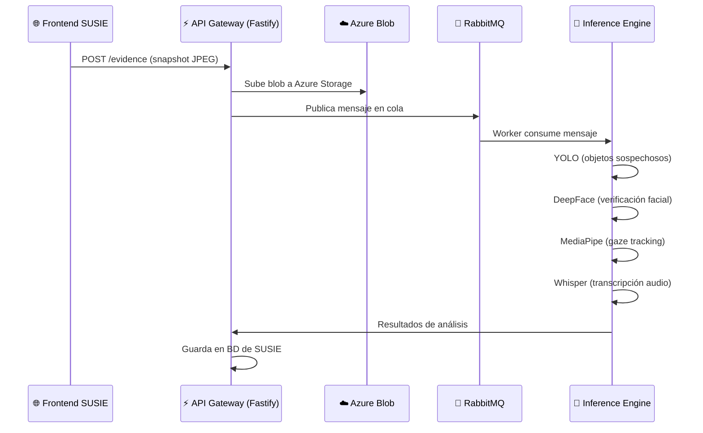

### Workers de IA

| Worker | Modelo | Qué analiza |
|--------|--------|------------|
| Detección de objetos | YOLO | Celulares, libros, personas extra |
| Verificación facial | DeepFace | ¿Es la misma persona del onboarding? |
| Análisis de mirada | MediaPipe | ¿Mira fuera de pantalla frecuentemente? |
| Transcripción | Whisper | ¿Habla con alguien? Dictado sospechoso |

---

## Fase 7: Fin del Examen — Entrega de Resultados

> **Actor:** SUSIE devuelve todo a Chaindrenciales

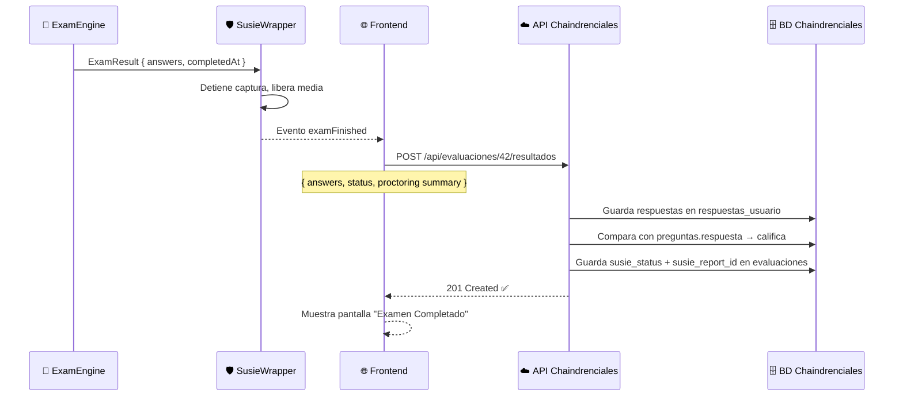

---

## Fase 8: Chaindrenciales Consulta Evidencias de SUSIE

> **Actor:** Reclutador/Evaluador en el dashboard de Chaindrenciales quiere ver el detalle de lo que pasó durante el examen.

Chaindrenciales recibió un `susie_report_id` cuando SUSIE envió los resultados (Fase 7). Con ese ID, puede consultar el API de SUSIE para obtener toda la evidencia almacenada.

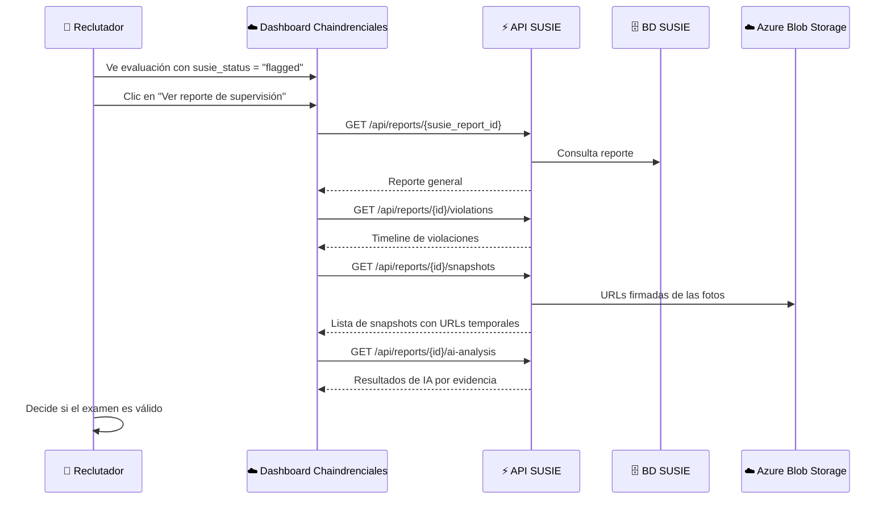

### Endpoints del API de SUSIE para consulta de evidencias

#### `GET /api/reports/:reportId` — Reporte general

```json
{
  "reportId": "rpt_abc123",
  "examSessionId": "sess_eval_42_1708456789",
  "status": "flagged",
  "summary": {
    "totalViolations": 2,
    "totalSnapshots": 45,
    "totalAudioChunks": 120,
    "examDurationSeconds": 1523,
    "consentGiven": true,
    "consentTimestamp": "2026-02-20T23:10:00Z",
    "biometricVerified": true
  },
  "riskLevel": "medium",
  "createdAt": "2026-02-20T23:45:00Z"
}
```

#### `GET /api/reports/:reportId/violations` — Timeline de violaciones

```json
{
  "violations": [
    {
      "id": 1,
      "type": "TAB_SWITCH",
      "message": "El candidato cambió de pestaña",
      "timestamp": "2026-02-20T23:18:32Z",
      "snapshotUrl": "https://storage.blob.core.windows.net/evidence/snap_001.jpg?sig=..."
    },
    {
      "id": 2,
      "type": "FULLSCREEN_EXIT",
      "message": "Salió de pantalla completa",
      "timestamp": "2026-02-20T23:22:15Z",
      "snapshotUrl": "https://storage.blob.core.windows.net/evidence/snap_015.jpg?sig=..."
    }
  ]
}
```

#### `GET /api/reports/:reportId/snapshots` — Fotos capturadas

```json
{
  "snapshots": [
    {
      "id": 1,
      "timestamp": "2026-02-20T23:12:00Z",
      "url": "https://storage.blob.core.windows.net/evidence/snap_001.jpg?sig=...",
      "aiAnalysis": {
        "facesDetected": 1,
        "faceMatchScore": 0.95,
        "objectsDetected": [],
        "gazeDirection": "center"
      }
    },
    {
      "id": 15,
      "timestamp": "2026-02-20T23:22:15Z",
      "url": "https://storage.blob.core.windows.net/evidence/snap_015.jpg?sig=...",
      "aiAnalysis": {
        "facesDetected": 2,
        "faceMatchScore": 0.93,
        "objectsDetected": ["cellphone"],
        "gazeDirection": "left"
      }
    }
  ]
}
```

#### `GET /api/reports/:reportId/audio` — Chunks de audio

```json
{
  "audioChunks": [
    {
      "id": 1,
      "timestamp": "2026-02-20T23:12:00Z",
      "durationSeconds": 15,
      "url": "https://storage.blob.core.windows.net/evidence/audio_001.webm?sig=...",
      "whisperTranscription": "",
      "voicesDetected": 1
    },
    {
      "id": 45,
      "timestamp": "2026-02-20T23:23:15Z",
      "durationSeconds": 15,
      "url": "https://storage.blob.core.windows.net/evidence/audio_045.webm?sig=...",
      "whisperTranscription": "la respuesta es la B, no la C",
      "voicesDetected": 2
    }
  ]
}
```

### Lo que se guarda en BD SUSIE vs Azure Blob

| Dato | Dónde se guarda | ¿Chaindrenciales lo ve? |
|------|----------------|------------------------|
| Snapshots (JPEG) | **Azure Blob Storage** | Sí, vía URLs firmadas temporales |
| Audio chunks (WebM) | **Azure Blob Storage** | Sí, vía URLs firmadas temporales |
| Violaciones (eventos) | **BD SUSIE** | Sí, vía endpoint `/violations` |
| Resultados de IA | **BD SUSIE** | Sí, vía endpoint `/ai-analysis` |
| Foto biométrica de referencia | **Azure Blob Storage** | Sí, incluida en el reporte |
| Metadata (correlation IDs) | **BD SUSIE** | Sí, en el reporte general |

### Flujo de decisión del Reclutador

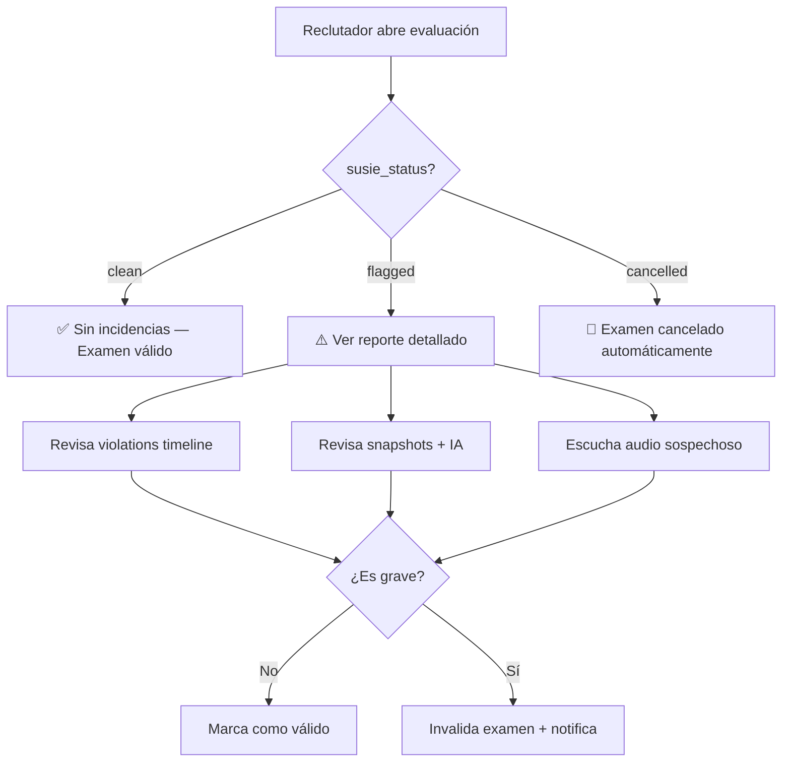

---

## Resumen Visual — Ciclo Completo

```mermaid
flowchart TB
    subgraph FASE1["📋 FASE 1: Creación"]
        A1["Reclutador crea examen"] --> A2["Configura preguntas"]
        A2 --> A3["Configura supervisión"]
    end

    subgraph FASE2["📨 FASE 2: Asignación"]
        B1["Asigna a candidato"] --> B2["Genera link"]
    end

    subgraph FASE3["🔗 FASE 3: Carga"]
        C1["Candidato abre link"] --> C2["GET susie-config"]
        C2 --> C3["mapToSusieConfig()"]
    end

    subgraph FASE4["🛡️ FASE 4: Pre-examen"]
        D1["Permisos media"] --> D2["Consentimiento"]
        D2 --> D3["Biometría"]
        D3 --> D4["Verificación entorno"]
    end

    subgraph FASE5["📝 FASE 5: Examen"]
        E1["ExamEngine + Timer"]
        E2["SecurityService"]
        E3["EvidenceService → Backend"]
        E1 --- E2
        E1 --- E3
    end

    subgraph FASE6["🤖 FASE 6: IA"]
        F1["YOLO + DeepFace"]
        F2["MediaPipe + Whisper"]
        F1 --- F2
    end

    subgraph FASE7["📊 FASE 7: Resultados"]
        G1["POST resultados a CH"]
        G2["CH califica"]
        G1 --> G2
    end

    subgraph FASE8["🔍 FASE 8: Consulta de Evidencias"]
        H1["Reclutador consulta reporte"]
        H2["Revisa snapshots + audio + IA"]
        H3["Decide validez del examen"]
        H1 --> H2 --> H3
    end

    FASE1 --> FASE2 --> FASE3 --> FASE4 --> FASE5
    FASE5 -->|"Evidencia async"| FASE6
    FASE5 -->|"Submit / Timeout"| FASE7
    FASE7 -->|"susie_report_id"| FASE8
```

