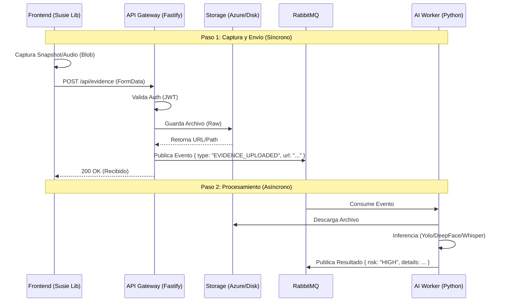

# 🌊 Flujo de Adquisición de Datos y Eventos (Team Guide)

> **Para:** Equipo de Desarrollo (Frontend, Backend, IA)
> **Objetivo:** Alinear cómo viaja la evidencia (Imágenes/Audio) desde el navegador hasta el motor de inferencia.

---

## 🏗️ arquitectura "Event-Driven"

El sistema funciona como una tubería. No esperamos a que la IA responda para confirmar al cliente.



---

## 🛠️ Detalles de Implementación por Capa

### 1. Frontend (`ngx-susie-proctoring`)
**Responsabilidad:** Generar Blobs y enviarlos vía HTTP POST.

*   **Endpoint:** `POST /api/v1/evidence`
*   **Formato:** `multipart/form-data`
*   **Campos del Formulario:**
    1.  `metadata` (String JSON):
        ```json
        {
          "meta": {
            "correlation_id": "session-123",
            "student_id": "user-456",
            "timestamp": "2026-02-18T10:00:00Z"
          },
          "payload": {
            "type": "SNAPSHOT", // o "AUDIO_CHUNK"
            "browser_focus": true
          }
        }
        ```
    2.  `file` (Binary): El archivo `.jpg` (Snapshot) o `.webm` (Audio Chunk).

> **💡 Nota para Vielma:** Actualmente `EvidenceService.sendEvent` necesita un refactor para aceptar el `file` blob y meterlo en el FormData correctamente.

---

### 2. Backend API Gateway
**Responsabilidad:** Recibir, Persistir y Notificar.

*   **Paquete:** `@fastify/multipart`
*   **Lógica:**
    1.  Recibir el `FormData`.
    2.  Guardar `file` en disco (dev) o Azure Blob (prod).
    3.  Construir el evento de notificación.
    4.  Publicar en Exchange `susie.events`.

**Ejemplo de Evento Publicado (RabbitMQ):**
```json
{
  "event_id": "evt-789",
  "type": "EVIDENCE_UPLOADED",
  "data": {
    "session_context": { ... },
    "file_url": "https://azure.../snap_123.jpg",
    "file_type": "SNAPSHOT", // Ayuda al worker a saber qué modelo usar
    "timestamp": "..."
  }
}
```

> **💡 Nota para Ramírez:** Asegurar que el controller de `/evidence` no bloquee esperando a RabbitMQ.

---

### 3. AI Workers (Inference Engine)
**Responsabilidad:** Escuchar, Descargar y Analizar.

*   **Cola:** `susie.ai.vision` (para Snapshots) / `susie.ai.audio` (para Audio).
*   **Flujo:**
    1.  Worker "YOLO" recibe el mensaje.
    2.  Descarga la imagen de `file_url`.
    3.  Corre inferencia.
    4.  Si detecta anomalía, publica en cola `susie.results`.

---

## 📋 Checklist de Tareas Pendientes (Gap Analysis)

Para completar este flujo, nos falta:

### Frontend
- [ ] **Bugfix:** `EvidenceService` debe permitir adjuntar `file` Blob en `sendEvent`.
- [ ] **Feat:** `SusieWrapper` debe pasar la foto biométrica al llamar a `sendEvent`.
- [ ] **Feat:** Cambiar el envío de audio de WebSocket a este endpoint `/evidence` (chunks de 3-5s).

### Backend
- [ ] **Feat:** Implementar endpoint POST `/api/v1/evidence` con soporte Multipart.
- [ ] **Feat:** Conectar este endpoint con el `ProducerService` para enviar a RabbitMQ.

### General
- [ ] Definir credenciales de Azure o ruta local compartida para que los workers accedan a los archivos.
