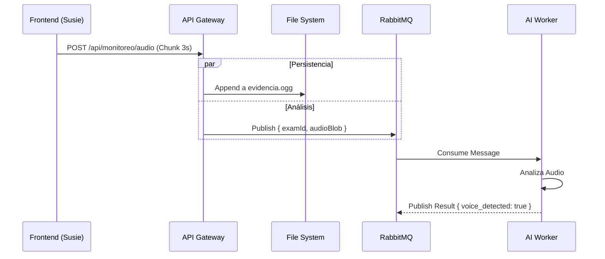

# 📡 Propuesta Técnica: Arquitectura de Audio Event-Driven para IA

> **Fecha:** 18 de Febrero de 2026
> **Objetivo:** Habilitar el análisis de audio en tiempo real mediante IA (Whisper/Clasificación) desacoplando la ingesta de audio del procesamiento.

---

## 1. El Problema Actual

La arquitectura actual utiliza un **WebSocket Stream (`ws://`)** que escribe directamente el audio entrante en el disco del servidor (`.ogg`).

| Característica | Impacto en IA |
|----------------|---------------|
| **Escritura en Disco** | ❌ **Alta Latencia**: El modelo de IA debe esperar a que el archivo se cierre o intentar leer un archivo en uso ("tailing"). |
| **Monolito** | ❌ **Acoplamiento**: El servicio de IA necesita acceso al sistema de archivos del API Gateway. |
| **Protocolo** | ⚠️ WebSocket es eficiente, pero complica la integración con balanceadores de carga y servicios serverless si no se gestiona bien el estado. |

---

## 2. La Solución: Arquitectura Híbrida (Event-Driven)

Cambiar el flujo para que el backend actúe como un **Distribuidor de Eventos**:
1.  **Frontend** envía pequeños fragmentos de audio (chunks) vía HTTP POST.
2.  **Backend** recibe el chunk y hace dos cosas en paralelo:
    *   **A) Persistencia**: Guarda el chunk en disco (append) para evidencia legal.
    *   **B) Inferencia**: Publica el chunk en una cola de **RabbitMQ** (`audio_analysis_queue`).
3.  **Workers IA** consumen de la cola, procesan el audio en memoria y devuelven resultados.



---

## 3. Cambios Requeridos (To-Do List)

### 3.1 Backend (API Gateway - Fastify)

#### 📦 Dependencias
- [ ] Instalar `@fastify/multipart` para manejar subidas de archivos `FormData`.

#### 🛠️ `AudioController`
- [ ] **Refactorizar**: Cambiar de `websocket` a un handler `HTTP POST`.
- [ ] **Lógica**:
    ```typescript
    // Pseudo-código
    async manejarAudio(req, reply) {
        const file = await req.file();
        const buffer = await file.toBuffer();

        // 1. Guardar en disco (Evidencia)
        await this.audioService.appendToFile(buffer, ...);

        // 2. Enviar a RabbitMQ (IA)
        // Se envía como Base64 para compatibilidad JSON
        await broker.publish('audio_analysis_queue', {
            examId: ...,
            timestamp: Date.now(),
            audioData: buffer.toString('base64')
        });

        return { status: 'ok' };
    }
    ```

#### 🛠️ `ProducerService`
- [ ] Verificar que soporte cargas útiles grandes (si se decide enviar blobs) o asegurar que los chunks sean de <1MB.

---

### 3.2 Frontend (`ngx-susie-proctoring`)

#### 🛠️ `EvidenceService`
- [ ] **Revertir WebSocket**: Eliminar la lógica de WebSocket implementada recientemente.
- [ ] **Implementar HTTP Post**:
    *   Usar `FormData` para enviar el blob.
    *   Endpoint: `POST /api/monitoreo/audio`.
- [ ] **Configuración**:
    *   Reducir `chunkIntervalSeconds` a **3 - 5 segundos**. (Actualmente 10s es mucho delay para IA).

---

### 3.3 Infraestructura IA (Workers)

- [ ] **Nuevo Consumer**: Crear un worker Python que escuche `audio_analysis_queue`.
- [ ] **Decodificación**: El worker debe recibir el Base64, convertir a audio en memoria y pasarlo al modelo.

## 4. Beneficios Esperados

1.  **Tiempo Real**: La IA recibe el audio milisegundos después de ser grabado.
2.  **Escalabilidad**: Si hay muchos alumnos, simplemente agregas más workers de IA consumiendo la cola.
3.  **Resiliencia**: Si la IA se cae, la evidencia legal (disco) NO se pierde.

---
**Firmado:** *Antigravity Agent*
