# 🤖 Análisis de Integración — 4 Modelos de IA en SUSIE

## Resumen

Los 4 modelos de IA están **bien implementados individualmente** y siguen un patrón consistente. Sin embargo, **NO se pueden integrar tal cual** porque hay **piezas clave faltantes** que conectan los modelos con el backend y entre sí.

---

## Estado Actual de Cada Modelo

### ✅ Lo que SÍ está listo

| Modelo | Archivo | Patrón | Output |
|--------|---------|--------|--------|
| **YOLO Vision** | [vision_yolo/main.py](file:///c:/Users/Yeyo_/OneDrive/Documentos/GitHub/SUSIE/ai_models/vision_yolo/main.py) | RabbitMQ Worker → Redis | Evento universal con `severity`, `event_type`, `details` |
| **Whisper Audio** | [audio_whisper/main.py](file:///c:/Users/Yeyo_/OneDrive/Documentos/GitHub/SUSIE/ai_models/audio_whisper/main.py) | RabbitMQ Worker → Redis | Evento universal (idéntico formato) |
| **Gaze MediaPipe** | [gaze_mediapipe/main.py](file:///c:/Users/Yeyo_/OneDrive/Documentos/GitHub/SUSIE/ai_models/gaze_mediapipe/main.py) | RabbitMQ Worker → Redis | Evento universal (idéntico formato) |
| **DeepFace Biométrico** | [biometric_deepface/main.py](file:///c:/Users/Yeyo_/OneDrive/Documentos/GitHub/SUSIE/ai_models/biometric_deepface/main.py) | FastAPI HTTP síncrono | JSON `{ auth, distance, message }` |

> [!TIP]
> El **formato universal de eventos** es consistente para 3 de los 4 modelos — esto es excelente porque facilita mucho la integración.

### Formato Universal que comparten YOLO, Whisper y Gaze:
```json
{
  "timestamp": "2026-...",
  "userId": "student_id",
  "sessionId": "session_id",
  "source": "yolo_vision | audio_nlp | gaze_tracker",
  "severity": "INFO | WARNING | CRITICAL",
  "event_type": "...",
  "details": { ... }
}
```

---

## 🚨 Lo que FALTA para la Integración Completa

### 1. Docker Compose no incluye los AI Workers

**Problema:** El [docker-compose.yml](file:///c:/Users/Yeyo_/OneDrive/Documentos/GitHub/SUSIE/docker-compose.yml) actual solo define RabbitMQ, PostgreSQL y Redis. **Ninguno de los 4 servicios de IA está declarado**.

**Qué falta:**
```yaml
# Estos 4 servicios faltan totalmente en docker-compose.yml
services:
  yolo-worker: ...
  whisper-worker: ...
  gaze-worker: ...
  deepface-api: ...
```

---

### 2. Backend (Fastify) no publica mensajes a RabbitMQ

**Problema:** Los workers de IA (YOLO, Whisper, Gaze) escuchan en colas de RabbitMQ (`q_snapshots`, `q_audios`, `gaze_tasks_queue`), pero el backend Fastify **no tiene un producer que publique mensajes** a esas colas. 

El [contrato de integración](file:///c:/Users/Yeyo_/OneDrive/Documentos/GitHub/SUSIE/CONTRATO_INTEGRACION_BACKEND.md) define los endpoints HTTP que reciben evidencia del frontend, pero la lógica para:
1. Subir el archivo a Azure Blob Storage
2. Publicar un mensaje en RabbitMQ con la URL del blob

...no está implementada.

**Colas esperadas por los workers:**

| Worker | Cola RabbitMQ | Payload esperado |
|--------|--------------|------------------|
| YOLO | `q_snapshots` | `{ student_id, session_id, image_url }` |
| Whisper | `q_audios` *(tiene espacio extra al final!)* | `{ student_id, session_id, audio_url, chunk_index }` |
| Gaze | `gaze_tasks_queue` | `{ student_id, session_id, gaze_buffer: [(x,y)...] }` |

---

### 3. Motor de Inferencia está vacío

**Problema:** El archivo [inference_engine/main.py](file:///c:/Users/Yeyo_/OneDrive/Documentos/GitHub/SUSIE/inference_engine/main.py) es un **esqueleto** que solo tiene un `# AI Logic goes here`. No hay lógica de correlación/fusión de señales.

Según la arquitectura, el motor debería:
- Leer eventos de Redis de los 3 workers
- Usar una **Red Bayesiana Naïve** (pgmpy) para correlacionar señales
- Calcular un **risk score** final por sesión
- Persistir resultados en PostgreSQL

---

### 4. No hay flujo Redis → PostgreSQL

**Problema:** Los 3 workers asíncronos (YOLO, Whisper, Gaze) escriben eventos al Redis en la key `proctoring:session_{sid}:user_{uid}`, pero **nada lee esos eventos de Redis para persistirlos** en PostgreSQL ni para generar el reporte final.

---

### 5. DeepFace no está conectado al flujo del Backend

**Problema:** DeepFace opera como API HTTP standalone (FastAPI), pero el backend Fastify **no tiene proxy/integración** para llamar `/api/register` o `/api/validate` de DeepFace.

Además:
- DeepFace usa [database.json](file:///c:/Users/Yeyo_/OneDrive/Documentos/GitHub/SUSIE/ai_models/biometric_deepface/database.json) como persistencia local, no PostgreSQL
- No tiene autenticación (cualquiera puede llamar los endpoints)
- Se necesitan endpoints en Fastify que deleguen las llamadas biométricas

---

### 6. Nombres de colas con inconsistencias

**Problema menor:** En [audio_whisper/main.py](file:///c:/Users/Yeyo_/OneDrive/Documentos/GitHub/SUSIE/ai_models/audio_whisper/main.py) línea 141:
```python
QUEUE_NAME = 'q_audios '  # <--- Espacio extra al final!
```
Esto causará un **bug silencioso** donde el producer publica a `q_audios` pero el worker escucha en `q_audios ` (con espacio).

---

### 7. Sin retry/reconnect robusto en los workers

**Problema:** Los 3 workers de RabbitMQ solo hacen un intento de conexión. Si falla, imprimen un mensaje y **terminan sin reintentar**. No hay loop de retry con backoff exponencial.

```python
# Código actual — sale sin reintentar
except pika.exceptions.AMQPConnectionError:
    print(f"[!] No se pudo conectar...")
```

---

### 8. Azure Blob Storage no está configurado

Ningún worker tiene configuración de Azure Blob Storage. Los workers asumen que reciben URLs directas para descargar, lo cual es correcto, pero el backend Fastify (que debe subir los blobs y generar las URLs) no tiene esa lógica implementada.

---

## Hoja de Ruta de Integración

Ordenado por prioridad y dependencia:

| # | Tarea | Componente | Impacto |
|---|-------|-----------|---------|
| 1 | Implementar **RabbitMQ Producer** en backend Fastify | `backend/` | 🔴 Bloqueante |
| 2 | Implementar **Azure Blob Upload** en backend | `backend/` | 🔴 Bloqueante |
| 3 | Agregar los **4 servicios AI al docker-compose** | [docker-compose.yml](file:///c:/Users/Yeyo_/OneDrive/Documentos/GitHub/SUSIE/docker-compose.yml) | 🔴 Bloqueante |
| 4 | Implementar **Motor de Inferencia** (leer Redis → Naive Bayes → PostgreSQL) | `inference_engine/` | 🟡 Necesario para reportes |
| 5 | Integrar **DeepFace** como servicio interno llamable por Fastify | `backend/ + biometric_deepface/` | 🟡 Necesario para biometría |
| 6 | Corregir **bug del espacio** en nombre de cola `q_audios` | `audio_whisper/main.py:141` | 🟢 Fix rápido |
| 7 | Agregar **retry con backoff** a los 3 workers | `ai_models/*/main.py` | 🟢 Mejora de resiliencia |
| 8 | Implementar **endpoints de reportes** (`/api/reports/...`) | `backend/` | 🟡 Necesario para Fase 8 |

> [!IMPORTANT]
> Las tareas **1, 2 y 3** son absolutamente bloqueantes. Sin ellas, los modelos de IA no reciben datos y no se ejecutan. El frontend envía evidencia HTTP al backend, pero el backend no la enruta a los workers.

---

## Conclusión

Los 4 modelos están **bien construidos y listos para funcionar**, pero les falta la **"fontanería" que los conecta**:

```mermaid
flowchart LR
    FE["Frontend"] -->|"HTTP POST"| BE["Backend Fastify"]
    BE -->|"❌ No implementado"| AZ["Azure Blob"]
    BE -->|"❌ No implementado"| RMQ["RabbitMQ"]
    RMQ -->|"✅ Listo"| YOLO["Worker YOLO"]
    RMQ -->|"✅ Listo"| WSP["Worker Whisper"]
    RMQ -->|"✅ Listo"| GAZE["Worker Gaze"]
    YOLO & WSP & GAZE -->|"✅ Escriben"| REDIS["Redis"]
    REDIS -->|"❌ No implementado"| INF["Motor de Inferencia"]
    INF -->|"❌ No implementado"| PG["PostgreSQL"]
    BE -->|"❌ No implementado"| DF["DeepFace API"]
    
    style AZ fill:#ff6b6b,color:#fff
    style RMQ fill:#ff6b6b,color:#fff
    style INF fill:#ff6b6b,color:#fff
    style DF fill:#ff6b6b,color:#fff
    style YOLO fill:#51cf66,color:#fff
    style WSP fill:#51cf66,color:#fff
    style GAZE fill:#51cf66,color:#fff
    style REDIS fill:#51cf66,color:#fff
```



En resumen: **los workers están listos pero aislados**. Necesitan que el backend les alimente datos (producer → RabbitMQ) y que alguien consuma sus resultados (motor de inferencia → PostgreSQL → reportes).
