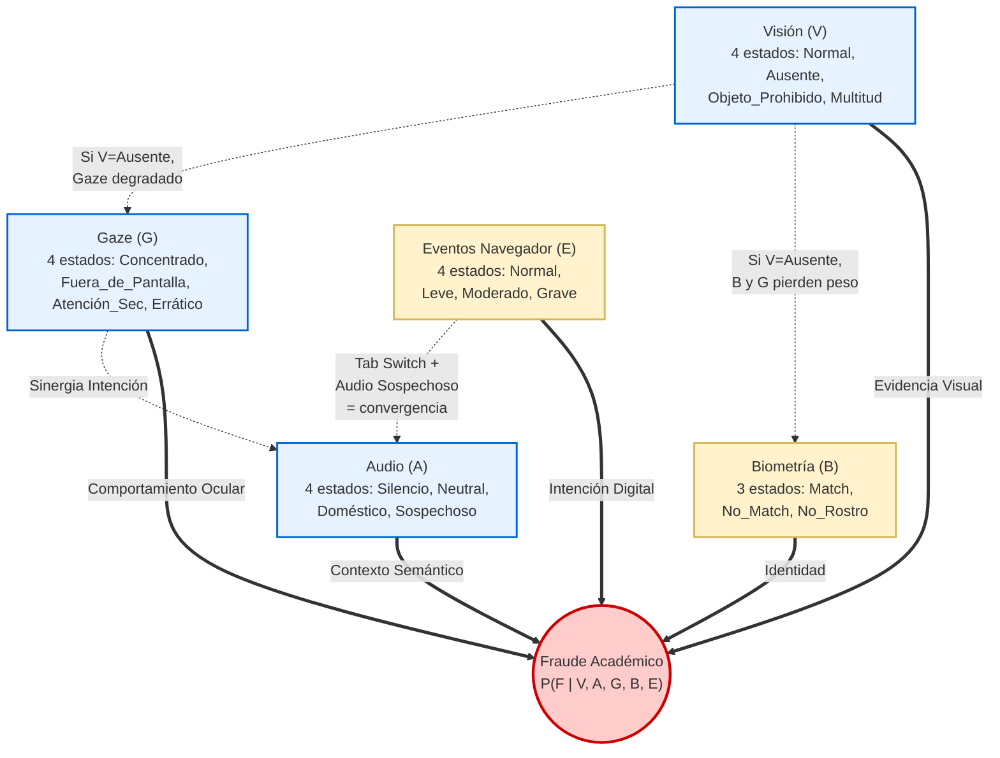

# Análisis: Nodos Faltantes en la CPT de la Red Bayesiana

> **Contexto:** El CPT actual solo modela 3 nodos (V, A, G) = 64 combinaciones.  
> Cruzando **todos** los documentos del proyecto, se identifican **2 fuentes de evidencia adicionales** que alimentan el sistema pero no están en la CPT.

---

## Inventario Completo de Fuentes de Evidencia

| # | Fuente | Tipo | ¿En la CPT actual? | Archivos que lo documentan |
|---|--------|------|--------------------|-----------------------------|
| 1 | **Visión (YOLO)** | Worker IA / Soft Evidence | ✅ Sí | `docs/Arquitectura...`, `worker_io_contracts.md` |
| 2 | **Audio (Whisper+NLP)** | Worker IA / Soft Evidence | ✅ Sí | `docs/Arquitectura...`, `worker_io_contracts.md` |
| 3 | **Mirada (Gaze)** | Worker IA / Soft Evidence | ✅ Sí | `docs/Arquitectura...`, `worker_io_contracts.md` |
| 4 | **Biometría (DeepFace)** | API REST / Síncrona | ❌ **FALTA** | `worker_io_contracts.md`, `PRD_SUSIE.md`, `FLUJO_COMPLETO_SUSIE.md` |
| 5 | **Eventos del Navegador** | Frontend / Determinísticos | ❌ **FALTA** | `CONTRATO_INTEGRACION_BACKEND.md`, `PAYLOAD_EVENTOS_SUSIE.md`, `PRD_SUSIE.md` |

---

## Nodo Faltante 1: Biometría (B) — DeepFace

### Evidencia en los documentos

**En [worker_io_contracts.md](file:///c:/Users/Yeyo_/OneDrive/Documentos/GitHub/SUSIE/docs/worker_io_contracts.md) §3:**
- `POST /api/compare` retorna `{ is_match, similarity_percent, distance }`
- El backend debe llamar periódicamente a DeepFace para verificar que la persona en cámara sea la misma del onboarding

**En [PRD_SUSIE.md](file:///c:/Users/Yeyo_/OneDrive/Documentos/GitHub/SUSIE/PRD_SUSIE.md):**
- **RF-007:** "El sistema debe capturar una foto del candidato... generar el embedding biométrico de referencia"
- **§9.2.4:** "DeepFace Worker: Verifica que la persona en cada snapshot sea la misma del onboarding biométrico"
- **§12.1:** `POST /biometrics/verify` — "Verifica la identidad del candidato contra el embedding de referencia"

**En [FLUJO_COMPLETO_SUSIE.md](file:///c:/Users/Yeyo_/OneDrive/Documentos/GitHub/SUSIE/FLUJO_COMPLETO_SUSIE.md) Fase 6:**
- DeepFace se lista como worker activo: "¿Es la misma persona del onboarding?"

**En [analysis_ai_models.md](file:///c:/Users/Yeyo_/OneDrive/Documentos/GitHub/SUSIE/analysis_ai_models.md):**
- Se lista como uno de los 4 modelos: "DeepFace (verificación facial)"

### Estados propuestos para el nodo B (Biometría)

| Estado | Descripción | Fuente |
|--------|-------------|--------|
| `Match` | El rostro detectado coincide con el embedding de referencia (`distance < umbral`) | `POST /api/compare → is_match: true` |
| `No_Match` | El rostro NO coincide — posible suplantación de identidad | `POST /api/compare → is_match: false` |
| `No_Rostro` | No se detectó ningún rostro en la imagen (coincide con YOLO `Ausente` pero es info independiente) | `POST /api/compare → 422 (no face)` |

### Impacto en la Red Bayesiana

La biometría es una señal **altísima** de suplantación:
- Si `B = No_Match` + cualquier combinación → la probabilidad de fraude debería dispararse (~95%) porque es un indicador directo de que no es la misma persona
- Si `B = Match` → funciona como factor neutro (no modifica las otras señales significativamente)
- Si `B = No_Rostro` → se correlaciona con `V = Ausente` (redundante pero con fuente independiente)

> [!IMPORTANT]
> DeepFace actualmente opera como API REST síncrona (no worker de cola). Para integrarlo al motor de inferencia, el backend necesitaría:
> 1. Llamar a `/api/compare` periódicamente cuando recibe snapshots
> 2. Guardar el resultado en Redis con la misma clave de sesión
> 3. El motor de inferencia lo consume como un nodo más

---

## Nodo Faltante 2: Eventos del Navegador (E) — SecurityService

### Evidencia en los documentos

**En [PAYLOAD_EVENTOS_SUSIE.md](file:///c:/Users/Yeyo_/OneDrive/Documentos/GitHub/SUSIE/PAYLOAD_EVENTOS_SUSIE.md):**
- 7 triggers documentados: `TAB_SWITCH`, `FULLSCREEN_EXIT`, `LOSS_FOCUS`, `DEVTOOLS_OPENED`, `NAVIGATION_ATTEMPT`, `RELOAD_ATTEMPT`, `CLIPBOARD_ATTEMPT`

**En [CONTRATO_INTEGRACION_BACKEND.md](file:///c:/Users/Yeyo_/OneDrive/Documentos/GitHub/SUSIE/CONTRATO_INTEGRACION_BACKEND.md) §3:**
- Endpoint: `POST /susie/api/v1/monitoreo/evidencias/eventos`
- Dice explícitamente: *"eventos lógicos que son **determinantes para el cálculo final de probabilidad de fraude** (Motor de Inferencia)"*

**En [PRD_SUSIE.md](file:///c:/Users/Yeyo_/OneDrive/Documentos/GitHub/SUSIE/PRD_SUSIE.md):**
- **RF-010:** Tab switch detection con límite configurable `maxTabSwitches`
- **RF-011:** DevTools detection como **"Violación Grave"**
- **RF-012:** Clipboard blocking
- **RF-016:** "Registro de Eventos del Navegador" — lista los 7 triggers

**En [MODELO_DATOS_SUSIE.md](file:///c:/Users/Yeyo_/OneDrive/Documentos/GitHub/SUSIE/MODELO_DATOS_SUSIE.md):**
- La tabla `infracciones_evaluacion` confirma: `tipo_infraccion` incluye `TAB_SWITCH`, `FULLSCREEN_EXIT`, `MULTIPLE_FACES`, `NO_FACE_DETECTED`

**En el backend [infraccion.interface.ts](file:///c:/Users/Yeyo_/OneDrive/Documentos/GitHub/SUSIE/backend/src/modules/monitoreo/infracciones/infraccion.interface.ts):**
- `tipo_infraccion: "CAMBIO_DE_PESTAÑA" | "USO_DE_TELEFONO" | "OTRO"` — ya modelado (aunque con tipos limitados)

### Estados propuestos para el nodo E (Eventos Navegador)

A diferencia de los workers IA que generan distribuciones de probabilidad, los eventos del navegador son **determinísticos** (ocurrieron o no). Para convertirlos en soft evidence compatible con la Red Bayesiana:

| Estado | Descripción | Eventos que lo causan |
|--------|-------------|----------------------|
| `Normal` | Sin eventos de seguridad en esta ventana temporal | Ningún trigger |
| `Leve` | Eventos menores que no implican intención de fraude directa | `LOSS_FOCUS`, `RELOAD_ATTEMPT` |
| `Moderado` | Eventos que sugieren posible consulta externa | `TAB_SWITCH`, `FULLSCREEN_EXIT`, `NAVIGATION_ATTEMPT` |
| `Grave` | Eventos que indican intención deliberada de manipulación | `DEVTOOLS_OPENED`, `CLIPBOARD_ATTEMPT` |

### Impacto en la Red Bayesiana

Los eventos del navegador son **señales determinísticas puras**:
- `E = Grave` (DevTools + Clipboard) → debería funcionar como un "boost" similar a `V = Objeto_Prohibido`
- `E = Moderado` (Tab Switch) → modula la interpretación de las otras señales (si el alumno sale de pestaña + audio sospechoso = convergencia fuerte)
- `E = Normal` → factor neutro
- La **frecuencia** importa: 1 tab switch es diferente de 5 en 2 minutos

> [!WARNING]
> Los eventos del navegador llegan al backend como JSON (`POST /monitoreo/evidencias/eventos`), no a través de workers IA. El backend necesitaría:
> 1. Cuando recibe un evento, guardarlo en Redis bajo la misma key de sesión
> 2. El motor de inferencia los agrupa por ventana temporal junto con V, A, G, B

---

## Nueva Topología de la Red Bayesiana

### CPT actual: 3 nodos = 4 × 4 × 4 = **64 combinaciones**
### CPT actualizada: 5 nodos = 4 × 4 × 4 × 3 × 4 = **768 combinaciones**

---

## Consideraciones para la CPT de 768 combinaciones

### ¿Es necesario escribir las 768 a mano?

**No.** La CPT se puede descomponer usando el modelo paramétrico aditivo (ya documentado para el Grupo 1 con Objeto_Prohibido):

$$P(\text{Fraude}) = \min\Big(P_{\text{base}}(V) + \Delta_A + \Delta_G + \Delta_B + \Delta_E,\; 0.99\Big)$$

Donde los deltas de los nuevos nodos serían:

| Parámetro | Valor | Justificación |
|-----------|-------|---------------|
| **$\Delta_B$ (`No_Match`)** | **+0.40** | Suplantación de identidad es extremadamente grave |
| **$\Delta_B$ (`Match`)** | **+0.00** | Factor neutro — la persona correcta |
| **$\Delta_B$ (`No_Rostro`)** | **+0.05** | Ligeramente sospechoso pero puede ser la misma persona fuera de frame |
| **$\Delta_E$ (`Grave`)** | **+0.25** | DevTools/Clipboard = manipulación deliberada |
| **$\Delta_E$ (`Moderado`)** | **+0.10** | Tab switch = posible consulta externa |
| **$\Delta_E$ (`Leve`)** | **+0.03** | Pérdida de foco casual |
| **$\Delta_E$ (`Normal`)** | **+0.00** | Sin eventos |

### Ejemplo con los 5 nodos

**Escenario:** Normal + Sospechoso + Errático + No_Match + Moderado

$$P = P_{base}(Normal=0.01) + \Delta_A(Sospechoso=+0.91) + \Delta_G(Errático=+0.07) + \Delta_B(No\_Match=+0.40) + \Delta_E(Moderado=+0.10)$$

$$P = \min(0.01 + 0.91 + 0.07 + 0.40 + 0.10, 0.99) = 0.99$$

→ Audio sospechoso + nerviosismo visual + **persona diferente** + cambio de pestaña = 99%

**Escenario:** Normal + Doméstico + Concentrado + Match + Leve

$$P = 0.01 + (-0.01) + (-0.10) + 0.00 + 0.03 = 0.01$$ (clamped al mínimo 1%)

→ Estudiante correcto, ruido doméstico, concentrado, sin eventos graves = 1%

---

## Dependencias Condicionales Especiales

### B ↔ V (Biometría ↔ Visión)

| Condición | Regla |
|-----------|-------|
| `V = Ausente` + `B = No_Rostro` | **Redundante**: si no hay persona, no hay rostro. B se ignora (peso = 0). El peso de V ya absorbe la penalización. |
| `V = Ausente` + `B = No_Match` | **Imposible**: si YOLO no detecta persona, DeepFace no debería retornar `No_Match` (no hay cara para comparar). Si ocurre → error del pipeline. |
| `V = Multitud` + `B = No_Match` | **Grave**: hay varias personas Y la principal no coincide = posible suplantación con cómplice. $\Delta_B$ sube a +0.45. |

### E ↔ A (Eventos ↔ Audio)

| Condición | Regla |
|-----------|-------|
| `E = Moderado (Tab Switch)` + `A = Sospechoso` | **Sinergia**: cambió de pestaña mientras hablaba con lenguaje de trampa. Confirma consulta externa. $\Delta_E$ sube de +0.10 a +0.15. |
| `E = Moderado (Tab Switch)` + `A = Silencio` | **Ambiguo**: puede estar leyendo otra cosa o fue accidental. $\Delta_E$ se mantiene en +0.10. |

---

## Resumen de Decisiones Necesarias

| # | Decisión | Opciones |
|---|----------|----------|
| 1 | **¿Incorporar Biometría como nodo?** | Sí (la documentación la describe como componente activo del motor de inferencia) / No (dejarla como validación booleana separada) |
| 2 | **¿Incorporar Eventos del Navegador como nodo?** | Sí (el contrato de integración dice explícitamente que son "determinantes para el cálculo final") / No (dejarlos solo como conteo de infracciones) |
| 3 | **¿Modelo paramétrico aditivo o CPT explícita?** | Aditivo (fórmula con deltas — más mantenible para 768 combinaciones) / Explícita (escribir las 768 a mano — más preciso pero inmantenible) |
| 4 | **¿Biometría con 3 o 2 estados?** | 3 estados (Match / No_Match / No_Rostro) / 2 estados (Match / No_Match, colapsando No_Rostro con el nodo V=Ausente) |
